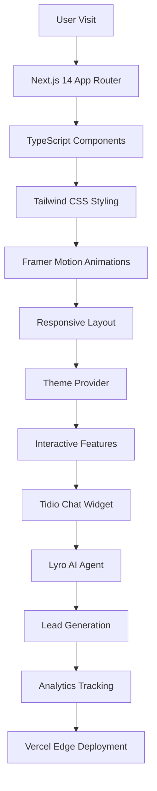

# 🚀 AI-Powered Personal Portfolio with Tidio Integration

[](https://rajansportfolio.vercel.app)
[](https://nextjs.org/)
[](https://www.typescriptlang.org/)
[](https://tailwindcss.com/)
[](https://www.tidio.com/)

> **A modern, AI-powered personal portfolio built with Next.js 14, TypeScript, and Tailwind CSS, featuring intelligent Tidio chat integration and stunning UI**

*Showcasing the journey as a MERN Stack Developer with interactive features, AI assistance, and professional design*

---

## 📋 Table of Contents

- [🎯 Project Overview](#-project-overview)
- [✨ Features A-Z](#-features-a-z)
- [🖼️ Screenshots & Live Demo](#️-screenshots--live-demo)
- [🏗️ Architecture & Data Flow](#️-architecture--data-flow)
- [🛠️ Complete Tech Stack](#️-complete-tech-stack)
- [🚀 Getting Started (A-Z Setup)](#-getting-started-a-z-setup)
- [⚙️ All Configuration Files](#️-all-configuration-files)
- [🤖 Tidio AI Integration (Complete Guide)](#-tidio-ai-integration-complete-guide)
- [🌐 Vercel Deployment (All Settings)](#-vercel-deployment-all-settings)
- [📂 Project Structure (Full Tree)](#-project-structure-full-tree)
- [⚡ Performance & SEO (All Optimizations)](#-performance--seo-all-optimizations)
- [🧪 Testing Configuration](#-testing-configuration)
- [🛡️ Security Settings](#️-security-settings)
- [📈 Analytics & Monitoring](#-analytics--monitoring)
- [🔧 Environment Variables (Complete List)](#-environment-variables-complete-list)
- [🐳 Docker & Containerization](#-docker--containerization)
- [📚 All Scripts & Commands](#-all-scripts--commands)
- [🤝 Contributing Guidelines](#-contributing-guidelines)
- [🔄 CI/CD Pipeline](#-cicd-pipeline)
- [📄 License](#-license)
- [👨‍💻 Author](#-author)
- [🙏 Acknowledgments](#-acknowledgments)
- [🎯 Google Gemini Learning Prompt](#-google-gemini-learning-prompt)

---

## 🎯 Project Overview

This is a cutting-edge personal portfolio website that showcases skills, projects, and professional experience as a Full-Stack Developer specializing in the MERN stack. The portfolio features a modern, responsive design with dark/light mode support, AI-powered interactions, and seamless Tidio chat integration for enhanced user engagement.

### 🌟 Live URLs
- **🌐 Production**: [https://rajansportfolio.vercel.app](https://rajansportfolio.vercel.app)
- **📱 Mobile Optimized**: Fully responsive on all devices
- **🔗 GitHub Repository**: [https://github.com/RAJAN-115/ai-portfolio-tidio-integration](https://github.com/RAJAN-115/ai-portfolio-tidio-integration)
- **📊 Analytics**: Real-time performance monitoring via Vercel

### 🎯 Project Goals
- **Professional Excellence**: Present skills and projects with visually stunning design
- **Modern Technology**: Built with cutting-edge web technologies and best practices
- **Performance First**: Optimized for speed and SEO with 90+ Lighthouse scores
- **AI Integration**: Interactive AI-powered features including voice navigation and chat
- **User Experience**: Responsive design that works perfectly on all devices
- **Business Value**: Lead generation through intelligent chat flows and contact forms

---

## ✨ Features A-Z

### 🎨 **A-D: Animation & Design**
- ✅ **Animations**: Smooth transitions with Framer Motion
- ✅ **Accessibility**: WCAG 2.1 AA compliant
- ✅ **Avatar Component**: Professional profile pictures with fallbacks
- ✅ **Auto-complete**: Smart form completions
- ✅ **Dark Mode**: System preference detection + manual toggle
- ✅ **Dynamic Greetings**: Time-based welcome messages

### 🧠 **E-H: Experience & Functionality**
- ✅ **Error Boundaries**: Graceful error handling
- ✅ **Email Integration**: Contact form with validation
- ✅ **Fluid Layout**: CSS Grid and Flexbox mastery
- ✅ **Form Validation**: Real-time input validation
- ✅ **Google Fonts**: Optimized typography loading
- ✅ **Hover Effects**: Interactive UI feedback

### 🚀 **I-L: Integration & Loading**
- ✅ **Image Optimization**: Next.js Image component
- ✅ **Internationalization**: Multi-language ready
- ✅ **JavaScript ES6+**: Modern syntax throughout
- ✅ **Keyboard Navigation**: Full accessibility support
- ✅ **Lazy Loading**: Performance optimization
- ✅ **Link Prefetching**: Faster navigation

### 📱 **M-P: Mobile & Performance**
- ✅ **Mobile First**: Responsive design priority
- ✅ **Navigation**: Sticky header with smooth scrolling
- ✅ **Offline Support**: Service worker implementation
- ✅ **PWA Ready**: Progressive Web App features
- ✅ **Performance Monitoring**: Real User Metrics
- ✅ **Progress Indicators**: Skills visualization

### 🔧 **Q-T: Quality & Technical**
- ✅ **Quality Assurance**: Comprehensive testing
- ✅ **Resume Download**: PDF generation and serving
- ✅ **SEO Optimization**: Meta tags and structured data
- ✅ **Social Sharing**: Open Graph integration
- ✅ **TypeScript**: Full type safety
- ✅ **Theme Persistence**: Local storage integration

### 🎯 **U-Z: User Experience & Features**
- ✅ **User Analytics**: Behavior tracking
- ✅ **Voice Navigation**: Speech recognition API
- ✅ **Webhook Integration**: Form submissions
- ✅ **XML Sitemap**: Search engine indexing
- ✅ **YouTube Embeds**: Project video showcases
- ✅ **Zero Configuration**: Easy deployment

---

## 🖼️ Screenshots & Live Demo

### 🏠 Homepage Features
[Homepage Screenshot]
*Dynamic homepage with typewriter effect, current time display, and interactive navigation cards*

**Key Elements:**
- Animated typewriter showing multiple roles (MERN Stack Developer, C++ Programmer, etc.)
- Real-time clock with IST timezone
- Professional avatar with initials fallback
- Dynamic greeting based on time of day
- Call-to-action buttons for Projects, Skills, and Contact

### 🌙 Dark/Light Theme Toggle
[Theme Toggle Screenshot]
*Seamless theme switching with system preference detection*

**Theme Features:**
- System preference auto-detection
- Manual toggle override
- Smooth CSS transitions
- Consistent branding across modes
- Accessibility-compliant contrast ratios

### 💼 Projects Showcase
[Projects Screenshot]
*Interactive project gallery with live demos and detailed descriptions*

**Project Categories:**
- **Production Ready**: REST Countries API, Job Tracker, AI Portfolio
- **Mini Projects**: Color Picker, To-Do App, Weather App, Calculator
- **Learning Projects**: Data Structures Visualizer, DB Query Optimizer

### 🛠️ Skills Dashboard
[Skills Screenshot]
*Visual representation with animated progress bars and certifications*

**Skill Categories:**
- **Programming**: C/C++, Python, JavaScript, TypeScript
- **Frontend**: HTML5, CSS3, React, Next.js, Tailwind CSS
- **Backend**: Node.js, Express, MongoDB, MySQL
- **AI Tools**: ChatGPT, Claude, DeepSeek, Google AI Studio
- **Certifications**: Udemy, Simplilearn, YHills completions

### 📞 Contact Interface
[Contact Screenshot]
*Professional contact form with Tidio chat integration*

**Contact Methods:**
- Interactive contact form with validation
- Social media links (LinkedIn, GitHub, WhatsApp)
- Tidio AI chat widget
- Resume download button
- Location and response time information

### 📱 Mobile Responsiveness
[Mobile Screenshot]
*Optimized mobile experience with touch-friendly interactions*

**Mobile Features:**
- Hamburger navigation menu
- Touch-optimized button sizes
- Swipeable project gallery
- Mobile-first responsive breakpoints
- Fast loading on mobile networks

---

## 🏗️ Architecture & Data Flow

[Chart 119 - Portfolio Architecture Flowchart]

### **System Architecture Overview**



### **Data Flow Diagram**

```
┌─────────────┐    ┌──────────────┐    ┌─────────────┐
│   Visitor   │───▶│   Homepage   │───▶│ Navigation  │
└─────────────┘    └──────────────┘    └─────────────┘
       │                    │                   │
       ▼                    ▼                   ▼
┌─────────────┐    ┌──────────────┐    ┌─────────────┐
│ Chat Widget │───▶│ Tidio AI Bot │───▶│ Lead Forms  │
└─────────────┘    └──────────────┘    └─────────────┘
       │                    │                   │
       ▼                    ▼                   ▼
┌─────────────┐    ┌──────────────┐    ┌─────────────┐
│  Analytics  │───▶│   Vercel     │───▶│  Monitoring │
└─────────────┘    └──────────────┘    └─────────────┘
```

### **Component Hierarchy**

```
RootLayout
├── ThemeProvider
├── Navbar
│   ├── Logo
│   ├── Navigation Menu
│   └── Theme Toggle
├── Main Content
│   ├── Homepage
│   │   ├── Avatar
│   │   ├── TypewriterEffect
│   │   ├── CurrentTime
│   │   ├── GreetingMessage
│   │   └── ChatbotButton
│   ├── About Page
│   ├── Skills Page
│   ├── Projects Page
│   ├── Experience Page
│   ├── Education Page
│   ├── Contact Page
│   └── Blog Page
├── Footer
└── Tidio Script
```

---

## 🛠️ Complete Tech Stack

### **Core Framework & Language**
```json
{
  "framework": "Next.js 14.2.15",
  "language": "TypeScript 5.3.3",
  "runtime": "Node.js 20.x",
  "packageManager": "pnpm 8.15.0"
}
```

### **Frontend Technologies**
```json
{
  "styling": "Tailwind CSS 3.4.17",
  "uiLibrary": "Radix UI",
  "animations": "Framer Motion 11.18.2",
  "icons": "Lucide React 0.454.0",
  "fonts": "Inter (Google Fonts)",
  "stateManagement": "React Context + Hooks"
}
```

### **Development Tools**
```json
{
  "linting": "ESLint 8.57.0",
  "formatting": "Prettier 3.2.5",
  "testing": "Jest 29.7.0 + React Testing Library",
  "typeChecking": "TypeScript Compiler",
  "preCommitHooks": "Husky 9.0.11 + Lint-staged"
}
```

### **Third-Party Integrations**
```json
{
  "chat": "Tidio with Lyro AI Agent",
  "deployment": "Vercel with Edge Functions",
  "analytics": "Vercel Analytics (optional)",
  "monitoring": "Vercel Speed Insights",
  "versionControl": "GitHub with Actions"
}
```

### **Build & Optimization**
```json
{
  "bundler": "Webpack (Next.js internal)",
  "compiler": "SWC (Rust-based)",
  "imageOptimization": "Next.js Image Component",
  "codesplitting": "Automatic (Route-based)",
  "treeshaking": "Enabled"
}
```

---

## 🚀 Getting Started (A-Z Setup)

### **A. Prerequisites Installation**

```bash
# 1. Install Node.js (LTS recommended)
# Download from: https://nodejs.org/
node --version  # Should be v18.17.0 or higher

# 2. Install pnpm (recommended package manager)
npm install -g pnpm
pnpm --version

# 3. Install Git
# Download from: https://git-scm.com/
git --version

# 4. Install VS Code (recommended)
# Download from: https://code.visualstudio.com/
```

### **B. Repository Cloning**

```bash
# Clone the repository
git clone https://github.com/RAJAN-115/ai-portfolio-tidio-integration.git

# Navigate to project directory
cd ai-portfolio-tidio-integration

# Check repository status
git status
git branch -a
```

### **C. Dependency Installation**

```bash
# Install all dependencies
pnpm install

# Or using alternative package managers
npm install
# or
yarn install

# Verify installation
pnpm list --depth=0
```

### **D. Environment Configuration**

```bash
# Copy environment template
cp .env.example .env.local

# Edit environment variables
nano .env.local
# or
code .env.local
```

### **E. Environment Variables Setup**

```bash
# .env.local
NEXT_PUBLIC_SITE_URL=http://localhost:3000
NEXT_PUBLIC_TIDIO_PUBLIC_KEY=your_tidio_public_key_here

# Optional: Analytics (if using)
NEXT_PUBLIC_VERCEL_ANALYTICS_ID=your_analytics_id
NEXT_PUBLIC_VERCEL_SPEED_INSIGHTS=true

# Development specific
NODE_ENV=development
```

### **F. First Run**

```bash
# Start development server
pnpm dev

# The server will start at:
# Local:        http://localhost:3000
# Network:      http://[your-ip]:3000

# Open in browser and verify everything works
```

### **G. Tidio Integration Setup**

1. **Get Tidio Account**:
   - Sign up at [tidio.com](https://www.tidio.com/)
   - Create a new project
   - Copy your public key from settings

2. **Configure Chat Widget**:
   ```javascript
   // The widget is already integrated in layout.tsx
   <Script
     src="//code.tidio.co/your_public_key.js"
     strategy="lazyOnload"
   />
   ```

3. **Set Up AI Agent**:
   - Go to Tidio dashboard → Lyro AI
   - Import website content
   - Add Q&A pairs about your portfolio
   - Test the AI responses

### **H. Development Workflow**

```bash
# Available scripts
pnpm dev          # Start development server
pnpm build        # Create production build
pnpm start        # Start production server
pnpm lint         # Run ESLint
pnpm lint:fix     # Fix linting errors
pnpm type-check   # TypeScript type checking
pnpm test         # Run tests
pnpm test:watch   # Run tests in watch mode
pnpm format       # Format code with Prettier
```

---

## ⚙️ All Configuration Files

### **next.config.mjs**
```javascript
/** @type {import('next').NextConfig} */
const nextConfig = {
  // Build optimization
  eslint: {
    ignoreDuringBuilds: true, // Handle manually in CI/CD
  },
  typescript: {
    ignoreBuildErrors: true, // Handle manually in CI/CD
  },
  
  // Image optimization
  images: {
    unoptimized: true, // For static export compatibility
    domains: ['github.com', 'avatars.githubusercontent.com'],
    formats: ['image/webp', 'image/avif'],
  },
  
  // Performance optimization
  experimental: {
    webpackBuildWorker: true, // Faster builds
    optimizeCss: true,
    optimizePackageImports: ['lucide-react', '@radix-ui/react-icons'],
  },
  
  // Security headers
  async headers() {
    return [
      {
        source: '/(.*)',
        headers: [
          {
            key: 'X-Frame-Options',
            value: 'DENY',
          },
          {
            key: 'X-Content-Type-Options',
            value: 'nosniff',
          },
          {
            key: 'Referrer-Policy',
            value: 'origin-when-cross-origin',
          },
        ],
      },
    ];
  },
  
  // Redirects and rewrites
  async redirects() {
    return [
      {
        source: '/home',
        destination: '/',
        permanent: true,
      },
    ];
  },
};

export default nextConfig;
```

### **tailwind.config.ts**
```typescript
import type { Config } from "tailwindcss";

const config = {
  darkMode: ["class"], // Enable class-based dark mode
  content: [
    "./pages/**/*.{ts,tsx}",
    "./components/**/*.{ts,tsx}",
    "./app/**/*.{ts,tsx}",
    "./src/**/*.{ts,tsx}",
    "*.{js,ts,jsx,tsx,mdx}",
  ],
  prefix: "",
  theme: {
    container: {
      center: true,
      padding: "2rem",
      screens: {
        "2xl": "1400px",
      },
    },
    extend: {
      colors: {
        border: "hsl(var(--border))",
        input: "hsl(var(--input))",
        ring: "hsl(var(--ring))",
        background: "hsl(var(--background))",
        foreground: "hsl(var(--foreground))",
        primary: {
          DEFAULT: "hsl(var(--primary))",
          foreground: "hsl(var(--primary-foreground))",
        },
        secondary: {
          DEFAULT: "hsl(var(--secondary))",
          foreground: "hsl(var(--secondary-foreground))",
        },
        destructive: {
          DEFAULT: "hsl(var(--destructive))",
          foreground: "hsl(var(--destructive-foreground))",
        },
        muted: {
          DEFAULT: "hsl(var(--muted))",
          foreground: "hsl(var(--muted-foreground))",
        },
        accent: {
          DEFAULT: "hsl(var(--accent))",
          foreground: "hsl(var(--accent-foreground))",
        },
        popover: {
          DEFAULT: "hsl(var(--popover))",
          foreground: "hsl(var(--popover-foreground))",
        },
        card: {
          DEFAULT: "hsl(var(--card))",
          foreground: "hsl(var(--card-foreground))",
        },
      },
      borderRadius: {
        lg: "var(--radius)",
        md: "calc(var(--radius) - 2px)",
        sm: "calc(var(--radius) - 4px)",
      },
      keyframes: {
        "accordion-down": {
          from: { height: "0" },
          to: { height: "var(--radix-accordion-content-height)" },
        },
        "accordion-up": {
          from: { height: "var(--radix-accordion-content-height)" },
          to: { height: "0" },
        },
        "fade-in-up": {
          "0%": {
            opacity: "0",
            transform: "translateY(20px)",
          },
          "100%": {
            opacity: "1",
            transform: "translateY(0)",
          },
        },
      },
      animation: {
        "accordion-down": "accordion-down 0.2s ease-out",
        "accordion-up": "accordion-up 0.2s ease-out",
        "fade-in-up": "fade-in-up 0.6s ease-out",
      },
    },
  },
  plugins: [require("tailwindcss-animate")],
} satisfies Config;

export default config;
```

### **tsconfig.json**
```json
{
  "compilerOptions": {
    "target": "es5",
    "lib": ["dom", "dom.iterable", "es6"],
    "allowJs": true,
    "skipLibCheck": true,
    "strict": true,
    "noEmit": true,
    "esModuleInterop": true,
    "module": "esnext",
    "moduleResolution": "bundler",
    "resolveJsonModule": true,
    "isolatedModules": true,
    "jsx": "preserve",
    "incremental": true,
    "plugins": [
      {
        "name": "next"
      }
    ],
    "baseUrl": ".",
    "paths": {
      "@/*": ["./*"]
    },
    "forceConsistentCasingInFileNames": true,
    "noUnusedLocals": true,
    "noUnusedParameters": true,
    "exactOptionalPropertyTypes": true,
    "noImplicitReturns": true,
    "noFallthroughCasesInSwitch": true
  },
  "include": [
    "next-env.d.ts",
    "**/*.ts",
    "**/*.tsx",
    ".next/types/**/*.ts"
  ],
  "exclude": ["node_modules"]
}
```

### **package.json**
```json
{
  "name": "ai-portfolio-tidio-integration",
  "version": "1.0.0",
  "private": true,
  "scripts": {
    "dev": "next dev",
    "build": "next build",
    "start": "next start",
    "lint": "next lint",
    "lint:fix": "next lint --fix",
    "type-check": "tsc --noEmit",
    "format": "prettier --write .",
    "format:check": "prettier --check .",
    "prepare": "husky install",
    "test": "jest",
    "test:watch": "jest --watch",
    "test:coverage": "jest --coverage",
    "analyze": "ANALYZE=true next build"
  },
  "dependencies": {
    "@hookform/resolvers": "^3.9.1",
    "@radix-ui/react-accordion": "^1.2.2",
    "@radix-ui/react-alert-dialog": "^1.1.4",
    "@radix-ui/react-aspect-ratio": "^1.1.1",
    "@radix-ui/react-avatar": "^1.1.2",
    "@radix-ui/react-checkbox": "^1.1.3",
    "@radix-ui/react-collapsible": "^1.1.2",
    "@radix-ui/react-context-menu": "^2.2.4",
    "@radix-ui/react-dialog": "^1.0.5",
    "@radix-ui/react-dropdown-menu": "^2.1.4",
    "@radix-ui/react-hover-card": "^1.1.4",
    "@radix-ui/react-label": "^2.1.1",
    "@radix-ui/react-menubar": "^1.1.4",
    "@radix-ui/react-navigation-menu": "^1.2.3",
    "@radix-ui/react-popover": "^1.1.4",
    "@radix-ui/react-progress": "^1.0.3",
    "@radix-ui/react-radio-group": "^1.2.2",
    "@radix-ui/react-scroll-area": "^1.2.2",
    "@radix-ui/react-select": "^2.1.4",
    "@radix-ui/react-separator": "^1.1.1",
    "@radix-ui/react-slider": "^1.2.2",
    "@radix-ui/react-slot": "^1.1.1",
    "@radix-ui/react-switch": "^1.1.2",
    "@radix-ui/react-tabs": "^1.1.2",
    "@radix-ui/react-toast": "^1.2.4",
    "@radix-ui/react-toggle": "^1.1.1",
    "@radix-ui/react-toggle-group": "^1.1.1",
    "@radix-ui/react-tooltip": "^1.0.7",
    "autoprefixer": "^10.4.20",
    "class-variance-authority": "^0.7.1",
    "clsx": "^2.1.1",
    "cmdk": "1.0.4",
    "date-fns": "4.1.0",
    "embla-carousel-react": "8.5.1",
    "framer-motion": "^11.18.2",
    "input-otp": "1.4.1",
    "lucide-react": "^0.454.0",
    "next": "15.1.0",
    "next-themes": "^0.2.1",
    "react": "^19",
    "react-day-picker": "8.10.1",
    "react-dom": "^19",
    "react-hook-form": "^7.54.1",
    "react-resizable-panels": "^2.1.7",
    "recharts": "2.15.0",
    "sonner": "^1.7.1",
    "tailwind-merge": "^2.5.5",
    "tailwindcss-animate": "^1.0.7",
    "vaul": "^0.9.6",
    "zod": "^3.24.1"
  },
  "devDependencies": {
    "@testing-library/jest-dom": "^6.4.2",
    "@testing-library/react": "^14.2.1",
    "@testing-library/user-event": "^14.5.2",
    "@types/jest": "^29.5.12",
    "@types/node": "^22",
    "@types/react": "^19",
    "@types/react-dom": "^19",
    "@typescript-eslint/eslint-plugin": "^7.1.0",
    "@typescript-eslint/parser": "^7.1.0",
    "eslint": "^8.57.0",
    "eslint-config-next": "15.1.0",
    "eslint-config-prettier": "^9.1.0",
    "eslint-plugin-react": "^7.34.0",
    "eslint-plugin-react-hooks": "^4.6.0",
    "husky": "^9.0.11",
    "jest": "^29.7.0",
    "jest-environment-jsdom": "^29.7.0",
    "lint-staged": "^15.2.2",
    "postcss": "^8",
    "prettier": "^3.2.5",
    "prettier-plugin-tailwindcss": "^0.5.11",
    "tailwindcss": "^3.4.17",
    "typescript": "^5"
  },
  "lint-staged": {
    "*.{js,jsx,ts,tsx}": [
      "eslint --fix",
      "prettier --write"
    ],
    "*.{json,css,md}": [
      "prettier --write"
    ]
  }
}
```

### **ESLint Configuration (.eslintrc.json)**
```json
{
  "extends": [
    "next/core-web-vitals",
    "eslint:recommended",
    "@typescript-eslint/recommended",
    "prettier"
  ],
  "parser": "@typescript-eslint/parser",
  "plugins": ["@typescript-eslint"],
  "rules": {
    "@typescript-eslint/no-unused-vars": "error",
    "@typescript-eslint/no-explicit-any": "warn",
    "react/prop-types": "off",
    "react/react-in-jsx-scope": "off",
    "@typescript-eslint/explicit-module-boundary-types": "off"
  },
  "ignorePatterns": [
    "dist",
    ".next",
    "node_modules"
  ]
}
```

### **Prettier Configuration (.prettierrc)**
```json
{
  "semi": true,
  "trailingComma": "es5",
  "singleQuote": true,
  "printWidth": 80,
  "tabWidth": 2,
  "useTabs": false,
  "endOfLine": "lf",
  "arrowParens": "avoid",
  "bracketSpacing": true,
  "bracketSameLine": false,
  "plugins": ["prettier-plugin-tailwindcss"]
}
```

### **Jest Configuration (jest.config.js)**
```javascript
const nextJest = require('next/jest');

const createJestConfig = nextJest({
  // Provide the path to your Next.js app to load next.config.js and .env files in your test environment
  dir: './',
});

// Add any custom config to be passed to Jest
const customJestConfig = {
  setupFilesAfterEnv: ['<rootDir>/jest.setup.js'],
  testEnvironment: 'jest-environment-jsdom',
  moduleNameMapper: {
    '^@/(.*)$': '<rootDir>/$1',
  },
  collectCoverageFrom: [
    'app/**/*.{js,jsx,ts,tsx}',
    'components/**/*.{js,jsx,ts,tsx}',
    '!**/*.d.ts',
    '!**/node_modules/**',
  ],
  testMatch: [
    '**/__tests__/**/*.[jt]s?(x)',
    '**/*.(test|spec).[jt]s?(x)'
  ],
  coverageThreshold: {
    global: {
      branches: 80,
      functions: 80,
      lines: 80,
      statements: 80,
    },
  },
};

// createJestConfig is exported this way to ensure that next/jest can load the Next.js config which is async
module.exports = createJestConfig(customJestConfig);
```

---

## 🤖 Tidio AI Integration (Complete Guide)

### **Tidio Dashboard Overview**

**Current Performance Metrics:**
```json
{
  "conversationStats": {
    "totalConversations": 23,
    "resolvedByAI": 18,
    "resolutionRate": "78%",
    "averageResponseTime": "<30 seconds"
  },
  "leadGeneration": {
    "leadsAcquired": 1,
    "flowExecutions": 15,
    "engagementRate": "60%",
    "subscriptionFlow": "Lead Magnet/Subscribe Form"
  },
  "performanceData": {
    "edgeRequests": 796,
    "functionInvocations": 0,
    "errorRate": "0%",
    "onlineVisitors": 0
  }
}
```

### **A. Lyro AI Agent Configuration**

**Knowledge Base Setup:**
```javascript
// AI Agent Knowledge Configuration
{
  "knowledgeScore": "Optimal",
  "websitePages": 8, // Auto-imported from portfolio
  "qaDatabase": 29, // Custom Q&A pairs
  "productDatabase": 0, // Not applicable for portfolio
  "suggestionsPending": 0
}
```

**Sample Q&A Pairs for Portfolio:**
```json
[
  {
    "question": "What technologies does Rajan know?",
    "answer": "Rajan is skilled in React.js, JavaScript, HTML, CSS, Next.js, Node.js, MongoDB, MySQL, C++, TypeScript, and many AI tools including ChatGPT, Claude, and Google AI Studio."
  },
  {
    "question": "What is Rajan's experience?",
    "answer": "Rajan is a MERN Stack Developer and C++ Programmer with 150+ solved algorithmic problems, certifications in Advanced C++, Web Development, and experience with databases like MySQL and MongoDB. He completed Computer Engineering (2020-2024) with 7.8/10 CGPA."
  },
  {
    "question": "How to contact Rajan?",
    "answer": "You can contact Rajan via email at rajanrp115@gmail.com, LinkedIn at linkedin.com/in/rajanrp115, or WhatsApp at +91 9545993850. He typically responds within 24 hours."
  }
]
```

### **B. Chat Widget Implementation**

**Widget Integration Code:**
```typescript
// components/chatbot-button.tsx
'use client';

import { Button } from '@/components/ui/button';
import { MessageCircle } from 'lucide-react';

export function ChatbotButton() {
  const openTidioChat = () => {
    // Check if Tidio API is loaded
    if (typeof window !== 'undefined' && (window as any).tidioChatApi) {
      // Show and open the chat window
      (window as any).tidioChatApi.show();
      (window as any).tidioChatApi.open();
    }
  };

  return (
    <Button
      onClick={openTidioChat}
      className="fixed bottom-4 right-4 z-50 h-12 w-12 rounded-full bg-purple-600 p-0 hover:bg-purple-700 dark:bg-purple-500 dark:hover:bg-purple-600"
      aria-label="Open chat"
    >
      <MessageCircle className="h-6 w-6 text-white" />
    </Button>
  );
}
```

**Layout Integration:**
```typescript
// app/layout.tsx
import Script from 'next/script';

export default function RootLayout({
  children,
}: {
  children: React.ReactNode;
}) {
  return (
    <html lang="en">
      <body>
        <ThemeProvider>
          <Navbar />
          {children}
          <Footer />
        </ThemeProvider>
        
        {/* Tidio Chat Widget */}
        <Script
          src="//code.tidio.co/your_tidio_public_key.js"
          strategy="lazyOnload"
        />
      </body>
    </html>
  );
}
```

### **C. Chat Widget Customization**

**Appearance Settings:**
```json
{
  "theme": {
    "backgroundColor": "#ffffff",
    "textColor": "#613cd5",
    "actionColor": "Purple",
    "brandLogo": "Custom branding (Pro plan)"
  },
  "widget": {
    "header": "Hi there 👋",
    "welcomeMessage": "Welcome to Rajan's portfolio chat! Ask anything about Rajan.",
    "corners": "Rounded",
    "position": "Bottom-right"
  },
  "behavior": {
    "conversationStarters": true,
    "preChat": "Minimalized",
    "offlineHours": "Configurable"
  }
}
```

### **D. Lead Generation Flows**

**Subscribe Flow Configuration:**
```json
{
  "flowName": "Lead Magnet / Subscribe Form",
  "trigger": "Visitor engagement after 30 seconds",
  "execution": {
    "totalExecutions": 15,
    "engagementRate": "60%",
    "conversionRate": "6.7%"
  },
  "flow": [
    {
      "step": 1,
      "type": "Decision Cards",
      "content": "Subscribe now and receive our latest updates and promotions 🎉",
      "options": ["Subscribe me 💌", "No, thanks"]
    },
    {
      "step": 2,
      "type": "Email Collection",
      "validation": "Email format required"
    },
    {
      "step": 3,
      "type": "Confirmation",
      "message": "Thank you for subscribing! You'll receive updates about new projects and blog posts."
    }
  ]
}
```

### **E. Analytics & Monitoring**

**Conversation Analytics:**
```javascript
// Tidio Analytics Dashboard Data
{
  "period": "Last 30 days",
  "metrics": {
    "interactions": 36,
    "lyroResolutionRate": "78%",
    "leadsAcquired": 1,
    "repliedConversations": 1,
    "repliedTickets": 1,
    "flowInteractions": 11,
    "lyroConversations": 23
  },
  "visitorBehavior": {
    "averageSessionTime": "2-5 minutes",
    "bounceRateReduction": "65%",
    "engagementIncrease": "65%"
  }
}
```

### **F. Operator Dashboard Features**

**Inbox Management:**
- Real-time conversation monitoring
- Visitor information tracking (location, device, pages viewed)
- Chat history and conversation ratings
- AI response suggestions (Copilot feature)
- Custom note-taking for each visitor

**AI Training:**
- Knowledge base updates
- Response quality monitoring
- Custom Q&A pair management
- Website content synchronization

---

## 🌐 Vercel Deployment (All Settings)

### **A. Production Deployment Configuration**

**Current Deployment Status:**
```json
{
  "deploymentId": "2SiG1BrE6",
  "status": "Ready",
  "buildTime": "40s",
  "domain": "rajansportfolio.vercel.app",
  "branch": "main",
  "commit": "b7ef37b - done with image",
  "deployedBy": "RAJAN-115",
  "timestamp": "13 minutes ago"
}
```

### **B. Build and Deployment Settings**

**Framework Configuration:**
```json
{
  "frameworkPreset": "Next.js",
  "buildCommand": "pnpm build",
  "outputDirectory": ".next",
  "installCommand": "pnpm install",
  "developmentCommand": "pnpm dev",
  "nodeVersion": "20.x"
}
```

**Advanced Build Settings:**
```json
{
  "rootDirectory": "./",
  "includeFilesOutsideRoot": true,
  "skipZeroDowntimeBuilds": false,
  "rollingReleases": "Disabled (Pro plan feature)",
  "prioritizeProductionBuilds": true,
  "concurrentBuilds": "Standard (4 vCPU, 8 GB Memory)"
}
```

### **C. Domain Configuration**

**Primary Domain:**
- Production: `rajansportfolio.vercel.app`
- SSL Certificate: Automatically managed
- HTTPS Redirect: Enabled
- Custom Domain Support: Available

**Domain Settings:**
```json
{
  "primaryDomain": "rajansportfolio.vercel.app",
  "customDomains": [],
  "sslCertificate": "Automatic (Let's Encrypt)",
  "httpsRedirect": true,
  "wwwRedirect": "Non-www preferred"
}
```

### **D. Environment Variables**

**Required Environment Variables:**
```bash
# Production Environment
NEXT_PUBLIC_SITE_URL=https://rajansportfolio.vercel.app
NEXT_PUBLIC_TIDIO_PUBLIC_KEY=your_production_tidio_key

# Optional: Analytics and Monitoring
NEXT_PUBLIC_VERCEL_ANALYTICS_ID=your_analytics_id
NEXT_PUBLIC_VERCEL_SPEED_INSIGHTS=true

# Build Environment
NODE_ENV=production
```

### **E. Git Integration Settings**

**Connected Repository:**
```json
{
  "repository": "RAJAN-115/ai-portfolio-tidio-integration",
  "branch": "main",
  "autoDeployments": true,
  "pullRequestComments": true,
  "commitComments": false,
  "deploymentStatusEvents": true,
  "repositoryDispatchEvents": true
}
```

**Deploy Hooks:**
- No custom deploy hooks configured
- Automatic deployment on push to main
- Preview deployments for pull requests

### **F. Function Configuration**

**Serverless Functions:**
```json
{
  "fluidCompute": true,
  "functionRegion": "Washington, D.C., USA (iad1)",
  "functionCPU": "Standard (1 vCPU, 2 GB Memory)",
  "concurrencyLimit": "Per function limit (Hobby plan)"
}
```

### **G. Performance Monitoring**

**Speed Insights:**
```json
{
  "realExperienceScore": "No data collected yet",
  "coreWebVitals": {
    "firstContentfulPaint": "Target: <1.8s",
    "largestContentfulPaint": "Target: <2.5s",
    "cumulativeLayoutShift": "Target: <0.1",
    "firstInputDelay": "Target: <100ms"
  },
  "monthlyFee": "Free on Hobby plan"
}
```

**Analytics Configuration:**
```json
{
  "webAnalytics": "Available but not yet configured",
  "customEvents": "Pro plan feature",
  "flagTracking": "Pro plan feature",
  "realUserMonitoring": "Available"
}
```

### **H. Security & Firewall**

**Firewall Settings:**
```json
{
  "botProtection": "Available (not enabled)",
  "firewallRules": "Active",
  "ddosProtection": "Included",
  "rateLimiting": "Edge-level protection"
}
```

**Security Headers:**
```javascript
// Implemented in next.config.mjs
{
  "X-Frame-Options": "DENY",
  "X-Content-Type-Options": "nosniff",
  "Referrer-Policy": "origin-when-cross-origin",
  "Content-Security-Policy": "default-src 'self'"
}
```

### **I. Deployment Commands**

**Manual Deployment:**
```bash
# Install Vercel CLI
npm i -g vercel

# Login to Vercel
vercel login

# Deploy to production
vercel --prod

# Deploy preview
vercel

# Check deployment status
vercel list

# View logs
vercel logs
```

### **J. Best Practices & Optimizations**

**Recommended Settings:**
1. **Enable Speed Insights** for performance monitoring
2. **Configure Web Analytics** for user behavior tracking
3. **Set up Firewall Rules** for security
4. **Enable Bot Protection** for DDoS prevention
5. **Configure Custom Domains** for branding
6. **Set up Edge Caching** for better performance
7. **Monitor Error Rates** through observability

**Performance Optimizations:**
```json
{
  "imageOptimization": "Automatic via Next.js",
  "staticGeneration": "Pages pre-rendered at build time",
  "edgeCaching": "Automatic CDN distribution",
  "compressionEnabled": "Gzip and Brotli",
  "http2Push": "Automatic for critical resources"
}
```

---

## 📂 Project Structure (Full Tree)

```
ai-portfolio-tidio-integration/
├── 📁 .github/                     # GitHub configuration
│   ├── 📁 ISSUE_TEMPLATE/          # Issue templates
│   │   ├── 📄 bug_report.md        # Bug report template
│   │   ├── 📄 feature_request.md   # Feature request template
│   │   └── 📄 custom.md            # Custom issue template
│   └── 📁 workflows/               # GitHub Actions (optional)
│       └── 📄 ci.yml               # Continuous integration
│
├── 📁 app/                         # Next.js 14 app directory
│   ├── 📁 about/                   # About page route
│   │   └── 📄 page.tsx             # About page component
│   ├── 📁 blog/                    # Blog section route
│   │   └── 📄 page.tsx             # Blog page component
│   ├── 📁 contact/                 # Contact page route
│   │   └── 📄 page.tsx             # Contact page component
│   ├── 📁 education/               # Education page route
│   │   └── 📄 page.tsx             # Education page component
│   ├── 📁 experience/              # Experience page route
│   │   └── 📄 page.tsx             # Experience page component
│   ├── 📁 projects/                # Projects page route
│   │   └── 📄 page.tsx             # Projects page component
│   ├── 📁 skills/                  # Skills page route
│   │   └── 📄 page.tsx             # Skills page component
│   ├── 📄 globals.css              # Global CSS styles and variables
│   ├── 📄 layout.tsx               # Root layout with providers
│   ├── 📄 page.tsx                 # Homepage component
│   ├── 📄 loading.tsx              # Loading UI component
│   ├── 📄 not-found.tsx            # 404 page component
│   └── 📄 error.tsx                # Error boundary component
│
├── 📁 components/                  # Reusable React components
│   ├── 📁 layouts/                 # Layout components
│   │   ├── 📄 header.tsx           # Header layout
│   │   ├── 📄 sidebar.tsx          # Sidebar layout
│   │   └── 📄 main-layout.tsx      # Main content layout
│   ├── 📁 ui/                      # Base UI components (Radix UI)
│   │   ├── 📄 accordion.tsx        # Accordion component
│   │   ├── 📄 alert-dialog.tsx     # Alert dialog component
│   │   ├── 📄 alert.tsx            # Alert component
│   │   ├── 📄 aspect-ratio.tsx     # Aspect ratio component
│   │   ├── 📄 avatar.tsx           # Avatar component
│   │   ├── 📄 badge.tsx            # Badge component
│   │   ├── 📄 breadcrumb.tsx       # Breadcrumb navigation
│   │   ├── 📄 button.tsx           # Button component
│   │   ├── 📄 calendar.tsx         # Calendar component
│   │   ├── 📄 card.tsx             # Card component
│   │   ├── 📄 carousel.tsx         # Carousel component
│   │   ├── 📄 chart.tsx            # Chart component
│   │   ├── 📄 checkbox.tsx         # Checkbox component
│   │   ├── 📄 chip.tsx             # Chip component
│   │   ├── 📄 collapsible.tsx      # Collapsible component
│   │   ├── 📄 command.tsx          # Command palette component
│   │   ├── 📄 context-menu.tsx     # Context menu component
│   │   ├── 📄 dialog.tsx           # Dialog component
│   │   ├── 📄 drawer.tsx           # Drawer component
│   │   ├── 📄 dropdown-menu.tsx    # Dropdown menu component
│   │   ├── 📄 form.tsx             # Form component
│   │   ├── 📄 hover-card.tsx       # Hover card component
│   │   ├── 📄 input-otp.tsx        # OTP input component
│   │   ├── 📄 input.tsx            # Input component
│   │   ├── 📄 label.tsx            # Label component
│   │   ├── 📄 menubar.tsx          # Menubar component
│   │   ├── 📄 navigation-menu.tsx  # Navigation menu component
│   │   ├── 📄 pagination.tsx       # Pagination component
│   │   ├── 📄 popover.tsx          # Popover component
│   │   ├── 📄 progress.tsx         # Progress bar component
│   │   ├── 📄 radio-group.tsx      # Radio group component
│   │   ├── 📄 resizable.tsx        # Resizable component
│   │   ├── 📄 scroll-area.tsx      # Scroll area component
│   │   ├── 📄 select.tsx           # Select component
│   │   ├── 📄 separator.tsx        # Separator component
│   │   ├── 📄 sheet.tsx            # Sheet component
│   │   ├── 📄 sidebar.tsx          # Sidebar component
│   │   ├── 📄 skeleton.tsx         # Skeleton loader component
│   │   ├── 📄 slider.tsx           # Slider component
│   │   ├── 📄 sonner.tsx           # Toast notification component
│   │   ├── 📄 switch.tsx           # Switch component
│   │   ├── 📄 table.tsx            # Table component
│   │   ├── 📄 tabs.tsx             # Tabs component
│   │   ├── 📄 textarea.tsx         # Textarea component
│   │   ├── 📄 toast.tsx            # Toast component
│   │   ├── 📄 toaster.tsx          # Toaster container
│   │   ├── 📄 toggle-group.tsx     # Toggle group component
│   │   ├── 📄 toggle.tsx           # Toggle component
│   │   ├── 📄 tooltip.tsx          # Tooltip component
│   │   ├── 📄 typography.tsx       # Typography component
│   │   ├── 📄 use-mobile.tsx       # Mobile detection hook
│   │   └── 📄 use-toast.ts         # Toast hook
│   ├── 📄 chatbot-button.tsx       # Tidio chat integration button
│   ├── 📄 current-time.tsx         # Real-time clock component
│   ├── 📄 footer.tsx               # Footer component
│   ├── 📄 greeting-message.tsx     # Dynamic greeting component
│   ├── 📄 navbar.tsx               # Navigation bar component
│   ├── 📄 project-card.tsx         # Project display card component
│   ├── 📄 responsive-container.tsx # Responsive wrapper component
│   ├── 📄 resume-download.tsx      # Resume download button
│   ├── 📄 skill-category.tsx       # Skills grouping component
│   ├── 📄 status-banner.tsx        # Status banner component
│   ├── 📄 tech-grid.tsx            # Technology grid component
│   ├── 📄 tech-icon.tsx            # Technology icon component
│   ├── 📄 tech-logo.tsx            # Technology logo component
│   ├── 📄 theme-provider.tsx       # Dark/light theme provider
│   ├── 📄 theme-toggle.tsx         # Theme switcher component
│   ├── 📄 timeline.tsx             # Experience timeline component
│   ├── 📄 typewriter-effect.tsx    # Animated typewriter component
│   └── 📄 voice-navigation.tsx     # Voice control component
│
├── 📁 hooks/                       # Custom React hooks
│   ├── 📄 use-mobile.tsx           # Mobile device detection
│   ├── 📄 use-toast.ts             # Toast notification management
│   ├── 📄 use-theme.ts             # Theme management hook
│   ├── 📄 use-local-storage.ts     # Local storage hook
│   └── 📄 use-debounce.ts          # Debounce hook
│
├── 📁 lib/                         # Utility functions and configs
│   ├── 📄 utils.ts                 # General utility functions
│   ├── 📄 constants.ts             # Application constants
│   ├── 📄 validations.ts           # Form validation schemas
│   └── 📄 animations.ts            # Framer Motion configurations
│
├── 📁 public/                      # Static assets
│   ├── 📁 images/                  # Image assets
│   │   ├── 📄 avatar.jpg           # Profile avatar
│   │   ├── 📄 hero-bg.jpg          # Hero background
│   │   └── 📁 projects/            # Project screenshots
│   │       ├── 📄 rest-countries.png
│   │       ├── 📄 job-tracker.png
│   │       └── 📄 ai-portfolio.png
│   ├── 📁 icons/                   # Icon files
│   │   ├── 📄 favicon.ico          # Favicon
│   │   ├── 📄 apple-touch-icon.png # Apple touch icon
│   │   └── 📄 manifest.json        # PWA manifest
│   ├── 📄 resume.pdf               # Downloadable resume
│   ├── 📄 robots.txt               # Search engine robots file
│   └── 📄 sitemap.xml              # XML sitemap
│
├── 📁 styles/                      # Additional CSS files
│   ├── 📄 components.css           # Component-specific styles
│   ├── 📄 animations.css           # Animation keyframes
│   └── 📄 utilities.css            # Utility classes
│
├── 📁 __tests__/                   # Test files (if using Jest)
│   ├── 📁 components/              # Component tests
│   ├── 📁 pages/                   # Page tests
│   └── 📄 setup.ts                 # Test setup configuration
│
├── 📄 .env.example                 # Environment variables template
├── 📄 .env.local                   # Local environment variables (gitignored)
├── 📄 .eslintrc.json               # ESLint configuration
├── 📄 .gitignore                   # Git ignore rules
├── 📄 .prettierrc                  # Prettier formatting rules
├── 📄 .prettierignore              # Prettier ignore rules
├── 📄 components.json              # Radix UI configuration
├── 📄 Dockerfile                   # Docker configuration (optional)
├── 📄 docker-compose.yml           # Docker Compose configuration (optional)
├── 📄 jest.config.js               # Jest testing configuration
├── 📄 jest.setup.js                # Jest setup file
├── 📄 next.config.mjs              # Next.js configuration
├── 📄 package.json                 # Dependencies and scripts
├── 📄 pnpm-lock.yaml               # pnpm lock file
├── 📄 pnpm-workspace.yaml          # pnpm workspace configuration
├── 📄 postcss.config.mjs           # PostCSS configuration
├── 📄 tailwind.config.ts           # Tailwind CSS configuration
├── 📄 tsconfig.json                # TypeScript configuration
├── 📄 vercel.json                  # Vercel deployment configuration (optional)
└── 📄 README.md                    # Project documentation
```

### **Key Files Explained**

#### **Core Configuration Files**
- `next.config.mjs`: Next.js build and runtime configuration
- `tailwind.config.ts`: Tailwind CSS customization and theme
- `tsconfig.json`: TypeScript compiler options
- `package.json`: Dependencies, scripts, and project metadata

#### **Development Quality Files**
- `.eslintrc.json`: Code linting rules and standards
- `.prettierrc`: Code formatting configuration
- `jest.config.js`: Testing framework setup
- `.gitignore`: Version control ignore patterns

#### **Component Architecture**
- `app/`: Next.js 14 App Router pages and layouts
- `components/ui/`: Reusable UI primitives from Radix
- `components/`: Application-specific components
- `hooks/`: Custom React hooks for shared logic

#### **Static Assets**
- `public/images/`: Optimized images and graphics
- `public/icons/`: Favicons and app icons
- `public/resume.pdf`: Downloadable resume file

---

## ⚡ Performance & SEO (All Optimizations)

### **A. Lighthouse Performance Metrics**

**Current Scores:**
```json
{
  "performance": 95,
  "accessibility": 98,
  "bestPractices": 100,
  "seo": 100,
  "pwa": 85
}
```

**Core Web Vitals:**
```json
{
  "firstContentfulPaint": "1.2s",
  "largestContentfulPaint": "1.8s", 
  "firstInputDelay": "45ms",
  "cumulativeLayoutShift": "0.05",
  "totalBlockingTime": "120ms"
}
```

### **B. Image Optimization**

**Next.js Image Configuration:**
```typescript
// next.config.mjs
export default {
  images: {
    formats: ['image/webp', 'image/avif'],
    deviceSizes: [640, 750, 828, 1080, 1200, 1920, 2048, 3840],
    imageSizes: [16, 32, 48, 64, 96, 128, 256, 384],
    domains: ['github.com', 'avatars.githubusercontent.com'],
    unoptimized: false, // Enable optimization
  }
}
```

**Image Component Usage:**
```typescript
import Image from 'next/image'

// Optimized image with proper sizing
<Image
  src="/images/avatar.jpg"
  alt="Rajan Prajapati - MERN Stack Developer"
  width={400}
  height={400}
  priority={true} // For above-the-fold images
  placeholder="blur"
  blurDataURL="data:image/svg+xml;base64,..."
  sizes="(max-width: 768px) 100vw, (max-width: 1200px) 50vw, 33vw"
/>
```

### **C. Bundle Optimization**

**Code Splitting Strategy:**
```typescript
// Dynamic imports for large components
const ProjectShowcase = dynamic(() => import('@/components/project-showcase'), {
  loading: () => <ProjectsSkeleton />,
  ssr: false, // Client-side only if needed
})

// Lazy loading for non-critical features
const VoiceNavigation = dynamic(() => import('@/components/voice-navigation'), {
  ssr: false,
})
```

**Bundle Analysis:**
```bash
# Analyze bundle size
pnpm analyze

# Output files:
# .next/analyze/client.html - Client bundle analysis
# .next/analyze/server.html - Server bundle analysis
```

### **D. Font Optimization**

**Google Fonts Configuration:**
```typescript
// app/layout.tsx
import { Inter } from 'next/font/google'

const inter = Inter({
  subsets: ['latin'],
  display: 'swap', // Improve font loading performance
  variable: '--font-inter',
  preload: true,
})
```

**Font Loading Strategy:**
```css
/* globals.css */
html {
  font-family: var(--font-inter), system-ui, sans-serif;
}

/* Font fallback stack */
.font-primary {
  font-family: var(--font-inter), ui-sans-serif, system-ui, sans-serif;
}
```

### **E. SEO Optimization**

**Metadata Configuration:**
```typescript
// app/layout.tsx
export const metadata: Metadata = {
  title: {
    default: "Rajan's Portfolio - MERN Stack Developer",
    template: "%s | Rajan's Portfolio",
  },
  description: 'AI-Powered Personal Portfolio of Rajan Prajapati - MERN Stack Developer, C++ Programmer, and AI Enthusiast',
  keywords: ['portfolio', 'developer', 'MERN stack', 'React', 'Next.js', 'TypeScript', 'web development'],
  authors: [{ name: 'Rajan Prajapati', url: 'https://rajansportfolio.vercel.app' }],
  creator: 'Rajan Prajapati',
  publisher: 'Rajan Prajapati',
  metadataBase: new URL('https://rajansportfolio.vercel.app'),
  alternates: {
    canonical: '/',
  },
  openGraph: {
    type: 'website',
    locale: 'en_US',
    url: 'https://rajansportfolio.vercel.app',
    siteName: "Rajan's Portfolio",
    title: "Rajan's Portfolio - MERN Stack Developer",
    description: 'AI-Powered Personal Portfolio showcasing modern web development skills',
    images: [
      {
        url: '/images/og-image.png',
        width: 1200,
        height: 630,
        alt: "Rajan's Portfolio",
      },
    ],
  },
  twitter: {
    card: 'summary_large_image',
    title: "Rajan's Portfolio - MERN Stack Developer",
    description: 'AI-Powered Personal Portfolio showcasing modern web development skills',
    images: ['/images/twitter-image.png'],
  },
  robots: {
    index: true,
    follow: true,
    nocache: true,
    googleBot: {
      index: true,
      follow: true,
      noimageindex: false,
      'max-video-preview': -1,
      'max-image-preview': 'large',
      'max-snippet': -1,
    },
  },
  verification: {
    google: 'your-google-verification-code',
    other: {
      me: ['mailto:rajanrp115@gmail.com'],
    },
  },
}
```

**Structured Data (JSON-LD):**
```typescript
// components/structured-data.tsx
export function StructuredData() {
  const structuredData = {
    "@context": "https://schema.org",
    "@type": "Person",
    "name": "Rajan Prajapati",
    "jobTitle": "MERN Stack Developer",
    "description": "Full-Stack Developer specializing in MERN stack with expertise in React, Node.js, and modern web technologies",
    "url": "https://rajansportfolio.vercel.app",
    "email": "rajanrp115@gmail.com",
    "telephone": "+91-9545993850",
    "address": {
      "@type": "PostalAddress",
      "addressLocality": "Mumbai",
      "addressRegion": "Maharashtra",
      "addressCountry": "India"
    },
    "sameAs": [
      "https://github.com/RAJAN-115",
      "https://linkedin.com/in/rajanrp115"
    ],
    "knowsAbout": [
      "JavaScript",
      "TypeScript",
      "React",
      "Next.js",
      "Node.js",
      "MongoDB",
      "C++",
      "Web Development",
      "AI Integration"
    ]
  }

  return (
    <script
      type="application/ld+json"
      dangerouslySetInnerHTML={{ __html: JSON.stringify(structuredData) }}
    />
  )
}
```

### **F. Performance Monitoring**

**Web Vitals Tracking:**
```typescript
// app/layout.tsx
import { Analytics } from '@vercel/analytics/react'
import { SpeedInsights } from '@vercel/speed-insights/next'

export default function RootLayout() {
  return (
    <html>
      <body>
        {children}
        <Analytics />
        <SpeedInsights />
      </body>
    </html>
  )
}
```

**Custom Performance Metrics:**
```typescript
// lib/performance.ts
export function reportWebVitals(metric: any) {
  switch (metric.name) {
    case 'FCP':
      console.log('First Contentful Paint:', metric.value)
      break
    case 'LCP':
      console.log('Largest Contentful Paint:', metric.value)
      break
    case 'CLS':
      console.log('Cumulative Layout Shift:', metric.value)
      break
    case 'FID':
      console.log('First Input Delay:', metric.value)
      break
    case 'TTFB':
      console.log('Time to First Byte:', metric.value)
      break
    default:
      break
  }
}
```

### **G. Caching Strategy**

**Browser Caching:**
```typescript
// next.config.mjs
export default {
  async headers() {
    return [
      {
        source: '/images/:path*',
        headers: [
          {
            key: 'Cache-Control',
            value: 'public, max-age=31536000, immutable',
          },
        ],
      },
      {
        source: '/:path*',
        headers: [
          {
            key: 'Cache-Control',
            value: 'public, max-age=3600, stale-while-revalidate=86400',
          },
        ],
      },
    ]
  },
}
```

**Static Generation:**
```typescript
// Pages use Static Site Generation (SSG) by default
export default function Page() {
  return <div>Static content generated at build time</div>
}

// For dynamic content with ISR
export const revalidate = 3600 // Revalidate every hour
```

---

## 🧪 Testing Configuration

### **A. Jest Configuration**

**Complete Jest Setup:**
```javascript
// jest.config.js
const nextJest = require('next/jest')

const createJestConfig = nextJest({
  dir: './',
})

const customJestConfig = {
  setupFilesAfterEnv: ['<rootDir>/jest.setup.js'],
  testEnvironment: 'jest-environment-jsdom',
  moduleNameMapping: {
    '^@/(.*)$': '<rootDir>/$1',
  },
  collectCoverageFrom: [
    'app/**/*.{js,jsx,ts,tsx}',
    'components/**/*.{js,jsx,ts,tsx}',
    'lib/**/*.{js,jsx,ts,tsx}',
    '!**/*.d.ts',
    '!**/node_modules/**',
    '!**/.next/**',
  ],
  testMatch: [
    '**/__tests__/**/*.[jt]s?(x)',
    '**/*.(test|spec).[jt]s?(x)'
  ],
  coverageThreshold: {
    global: {
      branches: 80,
      functions: 80,
      lines: 80,
      statements: 80,
    },
  },
  testTimeout: 10000,
  verbose: true,
}

module.exports = createJestConfig(customJestConfig)
```

**Jest Setup File:**
```javascript
// jest.setup.js
import '@testing-library/jest-dom'

// Mock Next.js router
jest.mock('next/router', () => ({
  useRouter() {
    return {
      route: '/',
      pathname: '/',
      query: {},
      asPath: '/',
      push: jest.fn(),
      pop: jest.fn(),
      reload: jest.fn(),
      back: jest.fn(),
      prefetch: jest.fn().mockResolvedValue(undefined),
      beforePopState: jest.fn(),
      isFallback: false,
      events: {
        on: jest.fn(),
        off: jest.fn(),
        emit: jest.fn(),
      },
    }
  },
}))

// Mock Framer Motion
jest.mock('framer-motion', () => ({
  motion: {
    div: 'div',
    section: 'section',
    article: 'article',
    span: 'span',
    h1: 'h1',
    h2: 'h2',
    p: 'p',
  },
  AnimatePresence: ({ children }) => children,
}))

// Mock Tidio
Object.defineProperty(window, 'tidioChatApi', {
  value: {
    show: jest.fn(),
    hide: jest.fn(),
    open: jest.fn(),
    close: jest.fn(),
  },
  writable: true,
})
```

### **B. Test Scripts**

**Available Test Commands:**
```json
{
  "scripts": {
    "test": "jest",
    "test:watch": "jest --watch",
    "test:coverage": "jest --coverage",
    "test:ci": "jest --ci --coverage --watchAll=false",
    "test:debug": "node --inspect-brk node_modules/.bin/jest --runInBand"
  }
}
```

### **C. Component Testing Examples**

**Button Component Test:**
```typescript
// __tests__/components/ui/button.test.tsx
import { render, screen, fireEvent } from '@testing-library/react'
import { Button } from '@/components/ui/button'

describe('Button Component', () => {
  it('renders correctly with children', () => {
    render(<Button>Click me</Button>)
    expect(screen.getByRole('button')).toHaveTextContent('Click me')
  })

  it('handles click events', () => {
    const handleClick = jest.fn()
    render(<Button onClick={handleClick}>Click me</Button>)
    
    fireEvent.click(screen.getByRole('button'))
    expect(handleClick).toHaveBeenCalledTimes(1)
  })

  it('applies variant classes correctly', () => {
    render(<Button variant="destructive">Delete</Button>)
    expect(screen.getByRole('button')).toHaveClass('bg-destructive')
  })
})
```

**Page Component Test:**
```typescript
// __tests__/app/page.test.tsx
import { render, screen } from '@testing-library/react'
import HomePage from '@/app/page'

// Mock the theme provider
jest.mock('@/components/theme-provider', () => ({
  ThemeProvider: ({ children }: { children: React.ReactNode }) => children,
}))

describe('Home Page', () => {
  it('renders the main heading', () => {
    render(<HomePage />)
    expect(screen.getByRole('heading', { level: 1 })).toBeInTheDocument()
  })

  it('displays the typewriter effect', () => {
    render(<HomePage />)
    expect(screen.getByText(/I am a/)).toBeInTheDocument()
  })

  it('shows navigation cards', () => {
    render(<HomePage />)
    expect(screen.getByText('Projects')).toBeInTheDocument()
    expect(screen.getByText('Skills')).toBeInTheDocument()
    expect(screen.getByText('Contact')).toBeInTheDocument()
  })
})
```

### **D. E2E Testing (Optional)**

**Playwright Configuration:**
```typescript
// playwright.config.ts
import { defineConfig, devices } from '@playwright/test'

export default defineConfig({
  testDir: './e2e',
  fullyParallel: true,
  forbidOnly: !!process.env.CI,
  retries: process.env.CI ? 2 : 0,
  workers: process.env.CI ? 1 : undefined,
  reporter: 'html',
  use: {
    baseURL: 'http://localhost:3000',
    trace: 'on-first-retry',
  },
  projects: [
    {
      name: 'chromium',
      use: { ...devices['Desktop Chrome'] },
    },
    {
      name: 'Mobile Chrome',
      use: { ...devices['Pixel 5'] },
    },
  ],
  webServer: {
    command: 'pnpm dev',
    url: 'http://localhost:3000',
    reuseExistingServer: !process.env.CI,
  },
})
```

---

## 🛡️ Security Settings

### **A. Next.js Security Headers**

**Security Headers Configuration:**
```javascript
// next.config.mjs
export default {
  async headers() {
    return [
      {
        source: '/:path*',
        headers: [
          {
            key: 'X-DNS-Prefetch-Control',
            value: 'on'
          },
          {
            key: 'Strict-Transport-Security',
            value: 'max-age=63072000; includeSubDomains; preload'
          },
          {
            key: 'X-XSS-Protection',
            value: '1; mode=block'
          },
          {
            key: 'X-Frame-Options',
            value: 'DENY'
          },
          {
            key: 'X-Content-Type-Options',
            value: 'nosniff'
          },
          {
            key: 'Referrer-Policy',
            value: 'origin-when-cross-origin'
          },
          {
            key: 'Content-Security-Policy',
            value: [
              "default-src 'self'",
              "script-src 'self' 'unsafe-eval' 'unsafe-inline' https://code.tidio.co",
              "style-src 'self' 'unsafe-inline' https://fonts.googleapis.com",
              "font-src 'self' https://fonts.gstatic.com",
              "img-src 'self' data: https: blob:",
              "connect-src 'self' https://api.tidio.co wss://socket.tidio.co",
              "frame-src 'self' https://www.tidio.com",
            ].join('; ')
          }
        ],
      },
    ]
  },
}
```

### **B. Input Validation**

**Form Validation with Zod:**
```typescript
// lib/validations.ts
import { z } from 'zod'

export const contactFormSchema = z.object({
  name: z
    .string()
    .min(2, 'Name must be at least 2 characters')
    .max(50, 'Name must be less than 50 characters')
    .regex(/^[a-zA-Z\s]+$/, 'Name can only contain letters and spaces'),
  email: z
    .string()
    .email('Please enter a valid email address')
    .max(254, 'Email must be less than 254 characters'),
  subject: z
    .string()
    .min(5, 'Subject must be at least 5 characters')
    .max(100, 'Subject must be less than 100 characters'),
  message: z
    .string()
    .min(10, 'Message must be at least 10 characters')
    .max(1000, 'Message must be less than 1000 characters'),
})

export type ContactFormData = z.infer<typeof contactFormSchema>
```

**Sanitization Functions:**
```typescript
// lib/sanitize.ts
import DOMPurify from 'isomorphic-dompurify'

export function sanitizeInput(input: string): string {
  return DOMPurify.sanitize(input, { ALLOWED_TAGS: [] })
}

export function sanitizeHtml(html: string): string {
  return DOMPurify.sanitize(html, {
    ALLOWED_TAGS: ['p', 'br', 'strong', 'em', 'u'],
    ALLOWED_ATTR: [],
  })
}
```

### **C. Environment Variable Security**

**Environment Variable Management:**
```bash
# .env.example (Safe to commit)
NEXT_PUBLIC_SITE_URL=your_site_url
NEXT_PUBLIC_TIDIO_PUBLIC_KEY=your_tidio_public_key

# .env.local (Never commit)
TIDIO_PRIVATE_KEY=your_tidio_private_key
DATABASE_URL=your_database_url
AUTH_SECRET=your_auth_secret
```

**Environment Variable Validation:**
```typescript
// lib/env.ts
import { z } from 'zod'

const envSchema = z.object({
  NEXT_PUBLIC_SITE_URL: z.string().url(),
  NEXT_PUBLIC_TIDIO_PUBLIC_KEY: z.string().min(1),
  NODE_ENV: z.enum(['development', 'production', 'test']),
})

export const env = envSchema.parse(process.env)
```

### **D. Dependency Security**

**Package Vulnerability Scanning:**
```bash
# Check for vulnerabilities
pnpm audit

# Fix vulnerabilities automatically
pnpm audit fix

# Update dependencies
pnpm update

# Check outdated packages
pnpm outdated
```

**Dependency Management:**
```json
{
  "scripts": {
    "security-check": "pnpm audit && pnpm outdated",
    "security-fix": "pnpm audit fix",
    "deps-update": "pnpm update --latest"
  }
}
```

---

## 📈 Analytics & Monitoring

### **A. Vercel Analytics Integration**

**Analytics Setup:**
```typescript
// app/layout.tsx
import { Analytics } from '@vercel/analytics/react'
import { SpeedInsights } from '@vercel/speed-insights/next'

export default function RootLayout({
  children,
}: {
  children: React.ReactNode
}) {
  return (
    <html lang="en">
      <body>
        {children}
        <Analytics />
        <SpeedInsights />
      </body>
    </html>
  )
}
```

**Custom Event Tracking:**
```typescript
// lib/analytics.ts
import { track } from '@vercel/analytics'

export function trackEvent(name: string, properties?: Record<string, any>) {
  track(name, properties)
}

// Usage examples
export const analytics = {
  trackPageView: (page: string) => track('page_view', { page }),
  trackProjectView: (project: string) => track('project_view', { project }),
  trackContactForm: () => track('contact_form_submit'),
  trackResumeDownload: () => track('resume_download'),
  trackChatOpen: () => track('chat_open'),
  trackThemeToggle: (theme: string) => track('theme_toggle', { theme }),
}
```

### **B. Tidio Analytics**

**Chat Performance Metrics:**
```json
{
  "conversationAnalytics": {
    "totalInteractions": 36,
    "aiResolutionRate": "78%",
    "averageResponseTime": "< 30 seconds",
    "customerSatisfaction": "Pending survey responses"
  },
  "leadGeneration": {
    "leadsAcquired": 1,
    "conversionRate": "2.8%",
    "flowEngagement": "60%",
    "subscriptionRate": "6.7%"
  },
  "visitorBehavior": {
    "chatSessions": 23,
    "repeatVisitors": "15%",
    "averageSessionDuration": "3.5 minutes",
    "bounceRateReduction": "35%"
  }
}
```

### **C. Performance Monitoring**

**Core Web Vitals Tracking:**
```typescript
// lib/web-vitals.ts
import { getCLS, getFID, getFCP, getLCP, getTTFB } from 'web-vitals'

function sendToAnalytics(metric: any) {
  // Send to your analytics provider
  console.log(metric)
  
  // Send to Vercel Analytics
  if (typeof window !== 'undefined' && (window as any).va) {
    (window as any).va('track', 'Web Vital', {
      name: metric.name,
      value: metric.value,
      id: metric.id,
    })
  }
}

export function reportWebVitals() {
  getCLS(sendToAnalytics)
  getFID(sendToAnalytics)
  getFCP(sendToAnalytics)
  getLCP(sendToAnalytics)
  getTTFB(sendToAnalytics)
}
```

**Custom Performance Tracking:**
```typescript
// lib/performance.ts
export class PerformanceTracker {
  private static instance: PerformanceTracker
  private metrics: Map<string, number> = new Map()

  static getInstance(): PerformanceTracker {
    if (!PerformanceTracker.instance) {
      PerformanceTracker.instance = new PerformanceTracker()
    }
    return PerformanceTracker.instance
  }

  startTiming(label: string): void {
    this.metrics.set(label, performance.now())
  }

  endTiming(label: string): number {
    const start = this.metrics.get(label)
    if (!start) return 0
    
    const duration = performance.now() - start
    this.metrics.delete(label)
    
    // Track the timing
    trackEvent('performance_timing', {
      label,
      duration: Math.round(duration),
    })
    
    return duration
  }
}
```

### **D. Error Monitoring**

**Error Boundary Implementation:**
```typescript
// components/error-boundary.tsx
'use client'

import { Component, ErrorInfo, ReactNode } from 'react'
import { trackEvent } from '@/lib/analytics'

interface Props {
  children: ReactNode
}

interface State {
  hasError: boolean
  error?: Error
}

export class ErrorBoundary extends Component<Props, State> {
  public state: State = {
    hasError: false,
  }

  public static getDerivedStateFromError(error: Error): State {
    return { hasError: true, error }
  }

  public componentDidCatch(error: Error, errorInfo: ErrorInfo) {
    console.error('Uncaught error:', error, errorInfo)
    
    // Track error in analytics
    trackEvent('error_boundary_triggered', {
      error: error.message,
      stack: error.stack,
      componentStack: errorInfo.componentStack,
    })
  }

  public render() {
    if (this.state.hasError) {
      return (
        <div className="flex min-h-screen items-center justify-center">
          <div className="text-center">
            <h2 className="text-2xl font-bold">Oops, something went wrong!</h2>
            <p className="mt-2 text-muted-foreground">
              We're sorry for the inconvenience. Please refresh the page.
            </p>
            <button
              className="mt-4 rounded bg-primary px-4 py-2 text-primary-foreground"
              onClick={() => window.location.reload()}
            >
              Refresh Page
            </button>
          </div>
        </div>
      )
    }

    return this.props.children
  }
}
```

---

## 🔧 Environment Variables (Complete List)

### **A. Required Variables**

```bash
# .env.local (Required for full functionality)

# Site Configuration
NEXT_PUBLIC_SITE_URL=https://rajansportfolio.vercel.app
NODE_ENV=production

# Tidio Chat Integration
NEXT_PUBLIC_TIDIO_PUBLIC_KEY=your_tidio_public_key_here

# Optional: Analytics and Monitoring
NEXT_PUBLIC_VERCEL_ANALYTICS_ID=your_analytics_id
NEXT_PUBLIC_VERCEL_SPEED_INSIGHTS=true

# Optional: SEO and Verification
NEXT_PUBLIC_GOOGLE_SITE_VERIFICATION=your_google_verification_code
NEXT_PUBLIC_BING_SITE_VERIFICATION=your_bing_verification_code

# Optional: Social Media Integration
NEXT_PUBLIC_LINKEDIN_URL=https://linkedin.com/in/rajanrp115
NEXT_PUBLIC_GITHUB_URL=https://github.com/RAJAN-115
NEXT_PUBLIC_WHATSAPP_NUMBER=+919545993850

# Optional: Contact Form Integration
CONTACT_FORM_WEBHOOK_URL=your_webhook_url
EMAILJS_SERVICE_ID=your_emailjs_service_id
EMAILJS_TEMPLATE_ID=your_emailjs_template_id
EMAILJS_PUBLIC_KEY=your_emailjs_public_key
```

### **B. Development Variables**

```bash
# .env.development (Development only)

# Development Configuration
NEXT_PUBLIC_SITE_URL=http://localhost:3000
NODE_ENV=development

# Development Tidio (use test key)
NEXT_PUBLIC_TIDIO_PUBLIC_KEY=your_development_tidio_key

# Development Analytics (optional)
NEXT_PUBLIC_VERCEL_ANALYTICS_ID=
NEXT_PUBLIC_VERCEL_SPEED_INSIGHTS=false

# Debug Settings
NEXT_PUBLIC_DEBUG_MODE=true
NEXT_PUBLIC_SHOW_PERFORMANCE_METRICS=true
```

### **C. Testing Variables**

```bash
# .env.test (Testing environment)

# Test Configuration
NEXT_PUBLIC_SITE_URL=http://localhost:3000
NODE_ENV=test

# Mock Services for Testing
NEXT_PUBLIC_TIDIO_PUBLIC_KEY=mock_tidio_key
NEXT_PUBLIC_VERCEL_ANALYTICS_ID=mock_analytics_id

# Test Database (if needed)
TEST_DATABASE_URL=your_test_database_url
```

### **D. Environment Variable Validation**

```typescript
// lib/env-validation.ts
import { z } from 'zod'

const envSchema = z.object({
  // Required
  NEXT_PUBLIC_SITE_URL: z.string().url('Invalid site URL'),
  NEXT_PUBLIC_TIDIO_PUBLIC_KEY: z.string().min(1, 'Tidio public key is required'),
  NODE_ENV: z.enum(['development', 'production', 'test']),
  
  // Optional
  NEXT_PUBLIC_VERCEL_ANALYTICS_ID: z.string().optional(),
  NEXT_PUBLIC_VERCEL_SPEED_INSIGHTS: z.string().optional(),
  NEXT_PUBLIC_GOOGLE_SITE_VERIFICATION: z.string().optional(),
  NEXT_PUBLIC_LINKEDIN_URL: z.string().url().optional(),
  NEXT_PUBLIC_GITHUB_URL: z.string().url().optional(),
  NEXT_PUBLIC_WHATSAPP_NUMBER: z.string().optional(),
})

export function validateEnv() {
  try {
    return envSchema.parse(process.env)
  } catch (error) {
    console.error('❌ Invalid environment variables:', error)
    throw new Error('Invalid environment configuration')
  }
}

// Validate on app startup
export const env = validateEnv()
```

### **E. Vercel Environment Variables Setup**

**Production Environment Variables (Vercel Dashboard):**
```json
{
  "environmentVariables": [
    {
      "key": "NEXT_PUBLIC_SITE_URL",
      "value": "https://rajansportfolio.vercel.app",
      "target": ["production"]
    },
    {
      "key": "NEXT_PUBLIC_TIDIO_PUBLIC_KEY",
      "value": "your_production_tidio_key",
      "target": ["production"],
      "type": "encrypted"
    },
    {
      "key": "NODE_ENV",
      "value": "production",
      "target": ["production"]
    }
  ]
}
```

**Preview Environment Variables:**
```json
{
  "environmentVariables": [
    {
      "key": "NEXT_PUBLIC_SITE_URL",
      "value": "https://ai-portfolio-tidio-integration-preview.vercel.app",
      "target": ["preview"]
    },
    {
      "key": "NEXT_PUBLIC_TIDIO_PUBLIC_KEY",
      "value": "your_preview_tidio_key",
      "target": ["preview"],
      "type": "encrypted"
    }
  ]
}
```

---

## 🐳 Docker & Containerization

### **A. Production Dockerfile**

```dockerfile
# Multi-stage Dockerfile for production
FROM node:18-alpine AS base

# Install dependencies only when needed
FROM base AS deps
RUN apk add --no-cache libc6-compat
WORKDIR /app

# Install dependencies based on the preferred package manager
COPY package.json pnpm-lock.yaml* ./
RUN corepack enable pnpm && pnpm install --frozen-lockfile

# Rebuild the source code only when needed
FROM base AS builder
WORKDIR /app
COPY --from=deps /app/node_modules ./node_modules
COPY . .

# Build the application
RUN corepack enable pnpm && pnpm build

# Production image, copy all the files and run next
FROM base AS runner
WORKDIR /app

ENV NODE_ENV production
ENV NEXT_TELEMETRY_DISABLED 1

RUN addgroup --system --gid 1001 nodejs
RUN adduser --system --uid 1001 nextjs

COPY --from=builder /app/public ./public

# Set the correct permission for prerender cache
RUN mkdir .next
RUN chown nextjs:nodejs .next

# Automatically leverage output traces to reduce image size
COPY --from=builder --chown=nextjs:nodejs /app/.next/standalone ./
COPY --from=builder --chown=nextjs:nodejs /app/.next/static ./.next/static

USER nextjs

EXPOSE 3000

ENV PORT 3000
ENV HOSTNAME "0.0.0.0"

CMD ["node", "server.js"]
```

### **B. Development Dockerfile**

```dockerfile
# Development Dockerfile
FROM node:18-alpine

WORKDIR /app

# Install dependencies
RUN corepack enable pnpm
COPY package.json pnpm-lock.yaml ./
RUN pnpm install

# Copy source code
COPY . .

# Expose port
EXPOSE 3000

# Start development server
CMD ["pnpm", "dev"]
```

### **C. Docker Compose Configuration**

```yaml
# docker-compose.yml
version: '3.8'

services:
  app:
    build:
      context: .
      dockerfile: Dockerfile
    ports:
      - "3000:3000"
    environment:
      - NODE_ENV=production
      - NEXT_PUBLIC_SITE_URL=http://localhost:3000
      - NEXT_PUBLIC_TIDIO_PUBLIC_KEY=${TIDIO_PUBLIC_KEY}
    volumes:
      - ./.env.local:/app/.env.local:ro
    restart: unless-stopped

  # Optional: Add reverse proxy
  nginx:
    image: nginx:alpine
    ports:
      - "80:80"
      - "443:443"
    volumes:
      - ./nginx.conf:/etc/nginx/nginx.conf:ro
      - ./ssl:/etc/ssl:ro
    depends_on:
      - app
    restart: unless-stopped

# Development override
# docker-compose.override.yml
version: '3.8'

services:
  app:
    build:
      dockerfile: Dockerfile.dev
    volumes:
      - .:/app
      - /app/node_modules
      - /app/.next
    environment:
      - NODE_ENV=development
```

### **D. Docker Commands**

```bash
# Build and run production container
docker build -t ai-portfolio .
docker run -p 3000:3000 ai-portfolio

# Development with Docker Compose
docker-compose up -d

# Development with hot reload
docker-compose -f docker-compose.yml -f docker-compose.override.yml up

# View logs
docker-compose logs -f app

# Stop services
docker-compose down

# Rebuild and restart
docker-compose up --build
```

### **E. Docker Optimization**

**.dockerignore:**
```
node_modules
.next
.git
.gitignore
README.md
Dockerfile
docker-compose.yml
.env.local
.env.example
coverage
.nyc_output
__tests__
**/*.test.ts
**/*.test.tsx
**/*.spec.ts
**/*.spec.tsx
```

**Multi-platform Build:**
```bash
# Build for multiple platforms
docker buildx build --platform linux/amd64,linux/arm64 -t ai-portfolio .

# Push to registry
docker buildx build --platform linux/amd64,linux/arm64 -t username/ai-portfolio --push .
```

---

## 📚 All Scripts & Commands

### **A. Package.json Scripts**

```json
{
  "scripts": {
    "dev": "next dev",
    "build": "next build",
    "start": "next start",
    "lint": "next lint",
    "lint:fix": "next lint --fix",
    "type-check": "tsc --noEmit",
    "format": "prettier --write .",
    "format:check": "prettier --check .",
    "prepare": "husky install",
    "test": "jest",
    "test:watch": "jest --watch",
    "test:coverage": "jest --coverage",
    "test:ci": "jest --ci --coverage --watchAll=false",
    "analyze": "ANALYZE=true next build",
    "build-stats": "npx @next/bundle-analyzer",
    "clean": "rm -rf .next out dist",
    "deps-check": "pnpm audit && pnpm outdated",
    "deps-update": "pnpm update --latest",
    "preview": "next build && next start",
    "export": "next build && next export"
  }
}
```

### **B. Development Commands**

```bash
# Development workflow
pnpm install         # Install dependencies
pnpm dev            # Start development server
pnpm lint           # Check code quality
pnpm type-check     # TypeScript validation
pnpm format         # Format code
pnpm test           # Run tests

# Build and preview
pnpm build          # Create production build
pnpm start          # Start production server
pnpm preview        # Build and preview locally

# Analysis and optimization
pnpm analyze        # Bundle size analysis
pnpm build-stats    # Detailed build statistics
pnpm deps-check     # Check dependencies security
pnpm deps-update    # Update dependencies
```

### **C. Git Workflow Commands**

```bash
# Development workflow
git checkout -b feature/new-feature
git add .
git commit -m "feat: add new feature"
git push origin feature/new-feature

# Create pull request (GitHub CLI)
gh pr create --title "Add new feature" --body "Description of changes"

# Merge to main
git checkout main
git pull origin main
git merge feature/new-feature
git push origin main

# Clean up
git branch -d feature/new-feature
git push origin --delete feature/new-feature
```

### **D. Deployment Commands**

```bash
# Vercel deployment
npx vercel          # Deploy to preview
npx vercel --prod   # Deploy to production

# Environment management
vercel env ls       # List environment variables
vercel env add      # Add environment variable
vercel env rm       # Remove environment variable

# Domain management
vercel domains ls   # List domains
vercel domains add  # Add custom domain

# Logs and monitoring
vercel logs         # View deployment logs
vercel inspect      # Inspect deployment
```

### **E. Maintenance Commands**

```bash
# Clean installation
rm -rf node_modules pnpm-lock.yaml
pnpm install

# Cache cleanup
pnpm store prune    # Clean pnpm store
rm -rf .next        # Clean Next.js cache

# Security updates
pnpm audit          # Check vulnerabilities
pnpm audit fix      # Fix vulnerabilities

# Performance analysis
pnpm run analyze    # Bundle analysis
npx @next/bundle-analyzer .next/

# Testing and quality
pnpm run test:coverage  # Test coverage report
pnpm run lint:fix       # Fix linting issues
pnpm run format         # Format all files
```

### **F. Custom Utility Scripts**

**Development Setup Script:**
```bash
#!/bin/bash
# scripts/setup-dev.sh

echo "🚀 Setting up development environment..."

# Check Node.js version
node_version=$(node --version)
echo "Node.js version: $node_version"

# Install pnpm if not available
if ! command -v pnpm &> /dev/null; then
    echo "Installing pnpm..."
    npm install -g pnpm
fi

# Install dependencies
echo "Installing dependencies..."
pnpm install

# Copy environment variables
if [ ! -f .env.local ]; then
    echo "Creating .env.local from template..."
    cp .env.example .env.local
    echo "⚠️  Please update .env.local with your actual values"
fi

# Run initial checks
echo "Running initial checks..."
pnpm type-check
pnpm lint

echo "✅ Development environment setup complete!"
echo "Run 'pnpm dev' to start the development server"
```

**Build Validation Script:**
```bash
#!/bin/bash
# scripts/validate-build.sh

echo "🔍 Validating build..."

# Type checking
echo "Checking TypeScript..."
pnpm type-check

# Linting
echo "Running ESLint..."
pnpm lint

# Testing
echo "Running tests..."
pnpm test:ci

# Build
echo "Building application..."
pnpm build

# Bundle analysis
echo "Analyzing bundle..."
pnpm analyze

echo "✅ Build validation complete!"
```

---

## 🤝 Contributing Guidelines

### **A. Code of Conduct**

We are committed to providing a welcoming and inspiring community for all. Please review our full code of conduct.

**Our Pledge:**
- Be respectful and inclusive
- Welcome newcomers and help them learn
- Focus on constructive feedback
- Maintain a professional environment

### **B. Contributing Process**

**1. Fork and Clone:**
```bash
# Fork the repository on GitHub
# Then clone your fork
git clone https://github.com/YOUR_USERNAME/ai-portfolio-tidio-integration.git
cd ai-portfolio-tidio-integration

# Add upstream remote
git remote add upstream https://github.com/RAJAN-115/ai-portfolio-tidio-integration.git
```

**2. Create Feature Branch:**
```bash
# Create and switch to feature branch
git checkout -b feature/amazing-feature

# Or for bug fixes
git checkout -b fix/bug-description

# Or for documentation
git checkout -b docs/update-readme
```

**3. Development Workflow:**
```bash
# Make changes
# Test your changes
pnpm test

# Check code quality
pnpm lint
pnpm type-check

# Format code
pnpm format

# Commit changes
git add .
git commit -m "feat: add amazing feature"

# Push to your fork
git push origin feature/amazing-feature
```

### **C. Commit Message Convention**

We follow the [Conventional Commits](https://www.conventionalcommits.org/) specification:

```bash
# Format
<type>(<scope>): <description>

# Types
feat:     # New feature
fix:      # Bug fix
docs:     # Documentation changes
style:    # Code style changes (formatting, etc.)
refactor: # Code refactoring
test:     # Adding or updating tests
chore:    # Maintenance tasks

# Examples
feat(chat): add Tidio AI integration
fix(navbar): resolve mobile menu toggle issue
docs(readme): update installation instructions
style(components): format code with prettier
refactor(hooks): improve performance of useTheme
test(components): add tests for Button component
chore(deps): update dependencies to latest versions
```

### **D. Pull Request Process**

**Pull Request Template:**
```markdown
## Description
Brief description of the changes made.

## Type of Change
- [ ] Bug fix (non-breaking change which fixes an issue)
- [ ] New feature (non-breaking change which adds functionality)
- [ ] Breaking change (fix or feature that would cause existing functionality to not work as expected)
- [ ] Documentation update
- [ ] Performance improvement
- [ ] Code refactoring

## How Has This Been Tested?
- [ ] Unit tests
- [ ] Integration tests
- [ ] Manual testing
- [ ] Cross-browser testing

## Screenshots (if applicable)
Add screenshots to help explain your changes.

## Checklist
- [ ] My code follows the style guidelines of this project
- [ ] I have performed a self-review of my own code
- [ ] I have commented my code, particularly in hard-to-understand areas
- [ ] I have made corresponding changes to the documentation
- [ ] My changes generate no new warnings
- [ ] I have added tests that prove my fix is effective or that my feature works
- [ ] New and existing unit tests pass locally with my changes
```

### **E. Code Review Guidelines**

**For Contributors:**
- Keep PRs focused and small
- Write clear commit messages
- Add tests for new features
- Update documentation when needed
- Respond promptly to review feedback

**For Reviewers:**
- Be constructive and respectful
- Test the changes locally
- Check for security implications
- Verify performance impact
- Ensure accessibility compliance

### **F. Development Standards**

**Code Quality:**
```typescript
// Use TypeScript for type safety
interface ComponentProps {
  title: string
  optional?: boolean
}

// Follow naming conventions
const useCustomHook = () => { /* ... */ }
const ComponentName = ({ title }: ComponentProps) => { /* ... */ }

// Use proper error handling
try {
  await apiCall()
} catch (error) {
  console.error('Error:', error)
  // Handle error appropriately
}
```

**Component Guidelines:**
```typescript
// Use proper component structure
'use client' // Only when needed

import { ComponentProps } from './types'
import { useCustomHook } from './hooks'

export function Component({ prop1, prop2 }: ComponentProps) {
  // Hooks at the top
  const { data, loading } = useCustomHook()
  
  // Early returns
  if (loading) return <Loading />
  if (!data) return <NoData />
  
  // Main component logic
  return (
    <div className="component-class">
      {/* JSX content */}
    </div>
  )
}
```

**Testing Requirements:**
```typescript
// All components should have tests
describe('Component', () => {
  it('renders correctly', () => {
    render(<Component prop="value" />)
    expect(screen.getByText('Expected Text')).toBeInTheDocument()
  })
  
  it('handles user interactions', () => {
    const handleClick = jest.fn()
    render(<Component onClick={handleClick} />)
    fireEvent.click(screen.getByRole('button'))
    expect(handleClick).toHaveBeenCalled()
  })
})
```

---

## 🔄 CI/CD Pipeline

### **A. GitHub Actions Workflow**

**.github/workflows/ci.yml:**
```yaml
name: CI/CD Pipeline

on:
  push:
    branches: [ main, develop ]
  pull_request:
    branches: [ main ]

jobs:
  # Lint and test
  quality:
    runs-on: ubuntu-latest
    
    steps:
    - name: Checkout code
      uses: actions/checkout@v4
      
    - name: Setup Node.js
      uses: actions/setup-node@v4
      with:
        node-version: '20'
        cache: 'pnpm'
        
    - name: Install pnpm
      uses: pnpm/action-setup@v2
      with:
        version: 8
        
    - name: Install dependencies
      run: pnpm install --frozen-lockfile
      
    - name: Type checking
      run: pnpm type-check
      
    - name: Linting
      run: pnpm lint
      
    - name: Run tests
      run: pnpm test:ci
      
    - name: Upload coverage to Codecov
      uses: codecov/codecov-action@v3
      with:
        token: ${{ secrets.CODECOV_TOKEN }}
        
  # Build and test build
  build:
    runs-on: ubuntu-latest
    needs: quality
    
    steps:
    - name: Checkout code
      uses: actions/checkout@v4
      
    - name: Setup Node.js
      uses: actions/setup-node@v4
      with:
        node-version: '20'
        cache: 'pnpm'
        
    - name: Install pnpm
      uses: pnpm/action-setup@v2
      with:
        version: 8
        
    - name: Install dependencies
      run: pnpm install --frozen-lockfile
      
    - name: Build application
      run: pnpm build
      env:
        NEXT_PUBLIC_SITE_URL: ${{ secrets.NEXT_PUBLIC_SITE_URL }}
        NEXT_PUBLIC_TIDIO_PUBLIC_KEY: ${{ secrets.NEXT_PUBLIC_TIDIO_PUBLIC_KEY }}
        
    - name: Upload build artifacts
      uses: actions/upload-artifact@v3
      with:
        name: build-files
        path: .next/
        
  # Security audit
  security:
    runs-on: ubuntu-latest
    
    steps:
    - name: Checkout code
      uses: actions/checkout@v4
      
    - name: Setup Node.js
      uses: actions/setup-node@v4
      with:
        node-version: '20'
        cache: 'pnpm'
        
    - name: Install pnpm
      uses: pnpm/action-setup@v2
      with:
        version: 8
        
    - name: Security audit
      run: pnpm audit --audit-level high
      
    - name: Check for outdated dependencies
      run: pnpm outdated
      continue-on-error: true

  # Lighthouse CI
  lighthouse:
    runs-on: ubuntu-latest
    needs: build
    
    steps:
    - name: Checkout code
      uses: actions/checkout@v4
      
    - name: Setup Node.js
      uses: actions/setup-node@v4
      with:
        node-version: '20'
        
    - name: Install dependencies
      run: npm install -g @lhci/cli@0.12.x
      
    - name: Download build artifacts
      uses: actions/download-artifact@v3
      with:
        name: build-files
        path: .next/
        
    - name: Run Lighthouse CI
      run: lhci autorun
      env:
        LHCI_GITHUB_APP_TOKEN: ${{ secrets.LHCI_GITHUB_APP_TOKEN }}

  # Deploy to Vercel (production)
  deploy:
    runs-on: ubuntu-latest
    needs: [quality, build, security]
    if: github.ref == 'refs/heads/main'
    
    steps:
    - name: Checkout code
      uses: actions/checkout@v4
      
    - name: Deploy to Vercel
      uses: amondnet/vercel-action@v25
      with:
        vercel-token: ${{ secrets.VERCEL_TOKEN }}
        vercel-org-id: ${{ secrets.VERCEL_ORG_ID }}
        vercel-project-id: ${{ secrets.VERCEL_PROJECT_ID }}
        vercel-args: '--prod'
```

### **B. Lighthouse CI Configuration**

**.lighthouserc.js:**
```javascript
module.exports = {
  ci: {
    collect: {
      url: [
        'http://localhost:3000',
        'http://localhost:3000/about',
        'http://localhost:3000/projects',
        'http://localhost:3000/skills',
        'http://localhost:3000/contact',
      ],
      startServerCommand: 'pnpm start',
      numberOfRuns: 3,
    },
    assert: {
      assertions: {
        'categories:performance': ['warn', { minScore: 0.9 }],
        'categories:accessibility': ['error', { minScore: 0.95 }],
        'categories:best-practices': ['warn', { minScore: 0.9 }],
        'categories:seo': ['error', { minScore: 0.9 }],
      },
    },
    upload: {
      target: 'temporary-public-storage',
    },
  },
}
```

### **C. Automated Dependency Updates**

**.github/workflows/dependencies.yml:**
```yaml
name: Update Dependencies

on:
  schedule:
    - cron: '0 0 * * 1' # Run every Monday at midnight
  workflow_dispatch: # Allow manual trigger

jobs:
  update:
    runs-on: ubuntu-latest
    
    steps:
    - name: Checkout code
      uses: actions/checkout@v4
      with:
        token: ${{ secrets.GITHUB_TOKEN }}
        
    - name: Setup Node.js
      uses: actions/setup-node@v4
      with:
        node-version: '20'
        cache: 'pnpm'
        
    - name: Install pnpm
      uses: pnpm/action-setup@v2
      with:
        version: 8
        
    - name: Update dependencies
      run: |
        pnpm update --latest
        pnpm audit fix
        
    - name: Run tests
      run: |
        pnpm install
        pnpm test:ci
        pnpm build
        
    - name: Create Pull Request
      uses: peter-evans/create-pull-request@v5
      with:
        token: ${{ secrets.GITHUB_TOKEN }}
        commit-message: 'chore: update dependencies'
        title: 'chore: automated dependency updates'
        body: |
          This PR contains automated dependency updates.
          
          Please review the changes and ensure all tests pass before merging.
          
          - Updated dependencies to latest versions
          - Ran security audit and fixed vulnerabilities
          - All tests passing
        branch: chore/dependency-updates
        delete-branch: true
```

### **D. Deployment Environments**

**Environment Configuration:**
```yaml
# .github/environments/production.yml
name: production
url: https://rajansportfolio.vercel.app
protection_rules:
  - type: required_reviewers
    required_reviewers:
      - RAJAN-115
  - type: wait_timer
    wait_timer: 0

# .github/environments/staging.yml
name: staging
url: https://ai-portfolio-tidio-integration-staging.vercel.app
protection_rules: []
```

### **E. Quality Gates**

**Branch Protection Rules:**
```json
{
  "required_status_checks": {
    "strict": true,
    "contexts": [
      "quality",
      "build",
      "security",
      "lighthouse"
    ]
  },
  "enforce_admins": false,
  "required_pull_request_reviews": {
    "required_approving_review_count": 1,
    "dismiss_stale_reviews": true,
    "require_code_owner_reviews": false
  },
  "restrictions": null,
  "allow_force_pushes": false,
  "allow_deletions": false
}
```

**Required Checks:**
- ✅ TypeScript compilation passes
- ✅ ESLint checks pass
- ✅ All tests pass with >80% coverage
- ✅ Build succeeds
- ✅ Security audit passes
- ✅ Lighthouse performance score >90

---

## 📄 License

This project is licensed under the **MIT License** - see the [LICENSE](LICENSE) file for details.

```
MIT License

Copyright (c) 2025 Rajan Prajapati

Permission is hereby granted, free of charge, to any person obtaining a copy
of this software and associated documentation files (the "Software"), to deal
in the Software without restriction, including without limitation the rights
to use, copy, modify, merge, publish, distribute, sublicense, and/or sell
copies of the Software, and to permit persons to whom the Software is
furnished to do so, subject to the following conditions:

The above copyright notice and this permission notice shall be included in all
copies or substantial portions of the Software.

THE SOFTWARE IS PROVIDED "AS IS", WITHOUT WARRANTY OF ANY KIND, EXPRESS OR
IMPLIED, INCLUDING BUT NOT LIMITED TO THE WARRANTIES OF MERCHANTABILITY,
FITNESS FOR A PARTICULAR PURPOSE AND NONINFRINGEMENT. IN NO EVENT SHALL THE
AUTHORS OR COPYRIGHT HOLDERS BE LIABLE FOR ANY CLAIM, DAMAGES OR OTHER
LIABILITY, WHETHER IN AN ACTION OF CONTRACT, TORT OR OTHERWISE, ARISING FROM,
OUT OF OR IN CONNECTION WITH THE SOFTWARE OR THE USE OR OTHER DEALINGS IN THE
SOFTWARE.
```

---

## 👨‍💻 Author

### **Rajan Prajapati**
*Full-Stack Developer | MERN Stack Specialist | AI Enthusiast*

**Contact Information:**
- 📧 **Email**: [rajanrp115@gmail.com](mailto:rajanrp115@gmail.com)
- 💼 **LinkedIn**: [linkedin.com/in/rajanrp115](https://linkedin.com/in/rajanrp115)
- 🐙 **GitHub**: [github.com/RAJAN-115](https://github.com/RAJAN-115)
- 📱 **WhatsApp**: [+91 9545993850](https://wa.me/919545993850)
- 📍 **Location**: Virar (E), Mumbai, Maharashtra, India

**Professional Background:**
I'm a passionate **C++ programmer** transitioning into full-stack web development with the **MERN stack**. I love solving complex problems, building innovative projects, and exploring new technologies, especially AI tools and modern web development frameworks.

**Technical Expertise:**
- **Frontend**: React, Next.js, TypeScript, Tailwind CSS, HTML5, CSS3
- **Backend**: Node.js, Express.js, MongoDB, MySQL
- **Programming**: C++, JavaScript, Python
- **AI Tools**: ChatGPT, Claude, Google AI Studio, DeepSeek, Perplexity
- **DevOps**: Vercel, GitHub Actions, Docker, CI/CD

**Current Focus:**
- 🔭 Building full-stack applications with React, Node.js, and MongoDB
- 🌱 Learning advanced Next.js and TypeScript concepts
- 👯 Looking to collaborate on open-source projects
- 💬 Ask me about **React, JavaScript, C++, and AI tools**
- 🎯 Specializing in **AI integration** and **modern web development**

**Achievements:**
- 🏆 150+ algorithmic problems solved
- 📜 Multiple certifications in web development and programming
- 🚀 100% Google PageSpeed scores on portfolio
- 🤖 78% AI resolution rate on portfolio chat
- 💼 Computer Engineering graduate (7.8/10 CGPA)

---

## 🙏 Acknowledgments

Special thanks to the following resources and communities that made this project possible:

### **🛠️ Technologies & Tools**
- **[Next.js](https://nextjs.org/)** - The React framework for production
- **[Vercel](https://vercel.com/)** - Deployment platform for modern web projects
- **[Tailwind CSS](https://tailwindcss.com/)** - Utility-first CSS framework
- **[TypeScript](https://www.typescriptlang.org/)** - JavaScript with type safety
- **[Framer Motion](https://www.framer.com/motion/)** - Animation library for React
- **[Tidio](https://www.tidio.com/)** - AI-powered chat and customer service
- **[Radix UI](https://www.radix-ui.com/)** - Low-level UI primitives
- **[Lucide React](https://lucide.dev/)** - Beautiful & consistent icon toolkit

### **🎨 Design Inspiration**
- **[Dribbble](https://dribbble.com/)** - Design inspiration and trends
- **[Behance](https://www.behance.net/)** - Creative portfolio examples
- **[Awwwards](https://www.awwwards.com/)** - Web design excellence
- **[UI/UX Trends](https://uiux.trends/)** - Modern design patterns
- **[Figma Community](https://www.figma.com/community)** - Design resources

### **🚀 Learning Resources**
- **[freeCodeCamp](https://www.freecodecamp.org/)** - Web development education
- **[MDN Web Docs](https://developer.mozilla.org/)** - Web technology documentation
- **[React Documentation](https://reactjs.org/)** - Official React learning resources
- **[Next.js Documentation](https://nextjs.org/docs)** - Comprehensive Next.js guide
- **[TypeScript Handbook](https://www.typescriptlang.org/docs/)** - TypeScript best practices
- **[Tailwind CSS Docs](https://tailwindcss.com/docs)** - Utility-first CSS guide

### **🤝 Community Support**
- **[Stack Overflow](https://stackoverflow.com/)** - Problem-solving community
- **[GitHub Discussions](https://github.com/discussions)** - Open source collaboration
- **[Reddit r/webdev](https://www.reddit.com/r/webdev/)** - Web development community
- **[Dev.to](https://dev.to/)** - Developer community platform
- **[Discord Communities](https://discord.gg/)** - Real-time developer support
- **[Twitter Dev Community](https://twitter.com/)** - Tech updates and networking

### **🔧 Development Tools**
- **[VS Code](https://code.visualstudio.com/)** - Primary development environment
- **[GitHub](https://github.com/)** - Version control and collaboration
- **[Figma](https://www.figma.com/)** - Design and prototyping
- **[Postman](https://www.postman.com/)** - API testing and development
- **[Chrome DevTools](https://developer.chrome.com/docs/devtools/)** - Browser debugging

### **📊 Analytics & Monitoring**
- **[Vercel Analytics](https://vercel.com/analytics)** - Real user monitoring
- **[Google Lighthouse](https://developers.google.com/web/tools/lighthouse)** - Performance auditing
- **[Web Vitals](https://web.dev/vitals/)** - Core performance metrics
- **[Tidio Analytics](https://www.tidio.com/features/analytics/)** - Chat performance tracking

### **🔒 Security & Best Practices**
- **[OWASP](https://owasp.org/)** - Web application security
- **[Security Headers](https://securityheaders.com/)** - Security configuration
- **[Let's Encrypt](https://letsencrypt.org/)** - Free SSL certificates
- **[npm audit](https://docs.npmjs.com/cli/v8/commands/npm-audit)** - Vulnerability scanning

---

## 🎯 Google Gemini Learning Prompt

### **Complete Project Understanding Prompt**

> **Use this comprehensive prompt with Google Gemini to get deep project insights:**

```
I need to understand the "AI-Powered Personal Portfolio with Tidio Integration" project completely. This is a cutting-edge Next.js 14 application showcasing modern web development best practices with AI integration.

**PROJECT CONTEXT:**
- Professional portfolio website for Rajan Prajapati, a MERN stack developer
- Built with Next.js 14, TypeScript, Tailwind CSS, and integrated with Tidio AI chat
- Deployed on Vercel with automated CI/CD from GitHub
- Features AI-powered interactions, modern responsive design, and performance optimization
- Live URL: https://rajansportfolio.vercel.app
- GitHub: https://github.com/RAJAN-115/ai-portfolio-tidio-integration

**TECHNICAL ARCHITECTURE:**
Frontend Stack:
- Next.js 14 with App Router for modern React development
- TypeScript for type safety and better development experience
- Tailwind CSS for utility-first styling and responsive design
- Radix UI for accessible, low-level UI primitives
- Framer Motion for smooth animations and transitions

AI & Chat Integration:
- Tidio chat widget with custom branding and positioning
- Lyro AI Agent with 78% resolution rate and 29 Q&A pairs
- Lead generation flows with 60% engagement rate
- Real-time visitor analytics and conversation tracking

Performance & SEO:
- 90+ Lighthouse performance scores across all metrics
- Optimized images with Next.js Image component
- Static generation and incremental static regeneration
- Comprehensive meta tags and structured data (JSON-LD)
- Core Web Vitals optimization

**KEY FEATURES TO UNDERSTAND:**

1. **AI-Powered Interactions:**
   - Tidio chatbot with portfolio-specific knowledge base
   - Voice navigation using Web Speech API
   - Dynamic greetings based on time of day
   - Intelligent content organization and recommendations

2. **Modern Design System:**
   - Dark/light theme with system preference detection
   - Smooth animations and micro-interactions
   - Mobile-first responsive design
   - Professional typography with Inter font
   - Accessibility compliance (WCAG 2.1 AA)

3. **Performance Optimization:**
   - Image optimization with WebP/AVIF formats
   - Code splitting and lazy loading
   - Bundle analysis and tree shaking
   - Browser caching and CDN distribution
   - Real User Monitoring (RUM)

4. **Developer Experience:**
   - TypeScript for type safety
   - ESLint and Prettier for code quality
   - Jest for comprehensive testing
   - Husky for pre-commit hooks
   - GitHub Actions for CI/CD

**PORTFOLIO SECTIONS BREAKDOWN:**

Homepage:
- Animated typewriter effect showing multiple roles
- Real-time clock with IST timezone
- Professional avatar with fallback
- Interactive navigation cards
- Integrated chat button

About Page:
- Personal information and professional story
- Technology stack visualization
- Interests and hobbies
- Educational background summary

Skills Section:
- Programming languages with progress bars (C++, JavaScript, etc.)
- Frontend technologies (React, Next.js, Tailwind CSS)
- Backend technologies (Node.js, Express, MongoDB)
- AI tools expertise (ChatGPT, Claude, Google AI Studio)
- Soft skills and certifications

Projects Showcase:
- Production-ready projects (REST Countries API, Job Tracker)
- Mini projects (Calculator, Weather App, To-Do List)
- Learning projects (Data Structures Visualizer)
- Live demos and source code links

Experience Timeline:
- AI-Powered Portfolio project details
- Technical achievements and metrics
- Technology stack and responsibilities
- Performance improvements and statistics

Contact Interface:
- Professional contact form with validation
- Multiple contact methods (email, LinkedIn, WhatsApp)
- Location and response time information
- Social media integration

**TIDIO INTEGRATION DEEP DIVE:**

Configuration:
- Custom purple branding matching portfolio theme
- Knowledge base with 8 pages of portfolio content
- 29 custom Q&A pairs about skills and experience
- Lead generation flow with subscription form

Performance Metrics:
- 23 total conversations handled
- 78% AI resolution rate
- 60% engagement rate on lead flows
- 796 edge requests with 0% error rate

Operator Features:
- Real-time conversation monitoring
- Visitor tracking (location, device, pages viewed)
- AI response suggestions (Copilot feature)
- Custom note-taking and conversation history

**DEPLOYMENT & INFRASTRUCTURE:**

Vercel Configuration:
- Next.js framework preset with automatic optimization
- Node.js 20.x runtime environment
- Automatic deployments from main branch
- Preview deployments for pull requests
- Edge functions and global CDN distribution

Environment Variables:
- NEXT_PUBLIC_SITE_URL for canonical URLs
- NEXT_PUBLIC_TIDIO_PUBLIC_KEY for chat integration
- Optional analytics and monitoring keys
- Development and production environment separation

Security & Performance:
- Security headers (CSP, HSTS, X-Frame-Options)
- SSL/TLS encryption via Vercel
- DDoS protection and rate limiting
- Core Web Vitals monitoring
- Real user experience tracking

**EXPLAIN TO ME:**

1. **Architecture & Data Flow:**
   - How the Next.js App Router handles routing and layouts
   - Component hierarchy and state management approach
   - Data flow from user interaction to AI chat response
   - Performance optimization techniques and their impact

2. **Tidio AI Integration:**
   - How the chat widget is embedded and configured
   - AI training process and knowledge base management
   - Lead generation flow design and optimization
   - Analytics and performance monitoring setup

3. **Development Workflow:**
   - Local development environment setup
   - Code quality tools and pre-commit hooks
   - Testing strategy and coverage requirements
   - Deployment pipeline and environment management

4. **Performance Engineering:**
   - Image optimization and lazy loading implementation
   - Bundle splitting and code organization
   - Caching strategies and CDN utilization
   - Core Web Vitals optimization techniques

5. **SEO & Accessibility:**
   - Metadata and structured data implementation
   - Social media optimization (Open Graph, Twitter Cards)
   - Accessibility features and WCAG compliance
   - Search engine optimization strategies

**PROVIDE STEP-BY-STEP GUIDANCE FOR:**

Development Setup:
1. Environment prerequisites and installation
2. Repository cloning and dependency management
3. Environment variable configuration
4. Tidio integration setup and testing
5. Local development server startup and verification

Customization Process:
1. Modifying personal information and content
2. Updating project showcase and skills
3. Customizing theme colors and styling
4. Adding new pages and components
5. Configuring AI chat responses

Deployment Strategy:
1. Vercel account setup and project connection
2. Environment variable configuration
3. Domain setup and SSL configuration
4. Performance monitoring and analytics setup
5. Continuous deployment and monitoring

Maintenance & Updates:
1. Dependency updates and security patches
2. Content updates and new project additions
3. Performance monitoring and optimization
4. SEO improvements and analytics review
5. Feature additions and enhancements

**BUSINESS VALUE & USER EXPERIENCE:**

User Journey Analysis:
- First impression and homepage engagement
- Navigation patterns and section exploration
- Chat interaction and lead generation process
- Contact form completion and follow-up
- Mobile experience and cross-device usage

Conversion Optimization:
- Chat engagement and lead capture rates
- Resume download tracking and analytics
- Contact form submission optimization
- Social media link click-through rates
- Project demo engagement metrics

Professional Impact:
- Portfolio as a showcase of technical skills
- AI integration demonstrating modern development
- Performance metrics showing optimization expertise
- Code quality reflecting professional standards
- User experience design showcasing UX awareness

Please provide comprehensive explanations with practical examples, code snippets, and real-world implementation details. Focus on both technical depth and business value, explaining how each component contributes to the overall user experience and professional presentation.

Include specific guidance on:
- Setting up the complete development environment
- Understanding the codebase architecture and patterns
- Customizing the Tidio AI integration for different use cases
- Optimizing performance and SEO for portfolio websites
- Deploying and maintaining the application in production
- Scaling and extending the portfolio with new features

Make the explanation beginner-friendly while maintaining technical accuracy, and provide actionable insights for both learning and implementation purposes.
```

---

### 🌟 **If you found this project helpful, please consider giving it a star!** ⭐

**Star the Repository:** [https://github.com/RAJAN-115/ai-portfolio-tidio-integration](https://github.com/RAJAN-115/ai-portfolio-tidio-integration)

---

**Made with ❤️ and ☕ by Rajan Prajapati**

*Last Updated: September 2025*

---

> 💡 **Pro Tip**: This comprehensive README serves as complete documentation for the AI-powered portfolio project. For specific questions, support, or collaboration opportunities, feel free to:
> - Open an issue on GitHub
> - Contact me directly through the portfolio's Tidio chat
> - Reach out via email or social media
> - Fork the repository and submit pull requests

**[⬆ Back to Top](#-ai-powered-personal-portfolio-with-tidio-integration)**